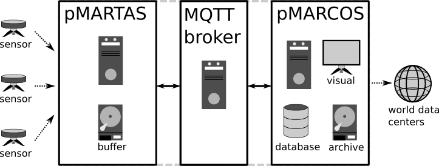
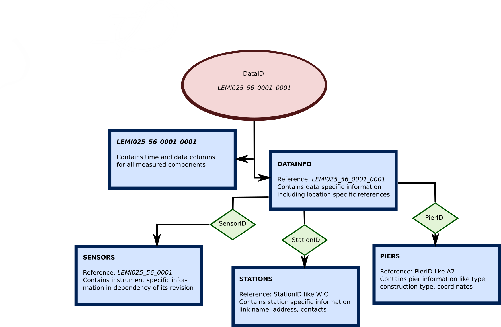
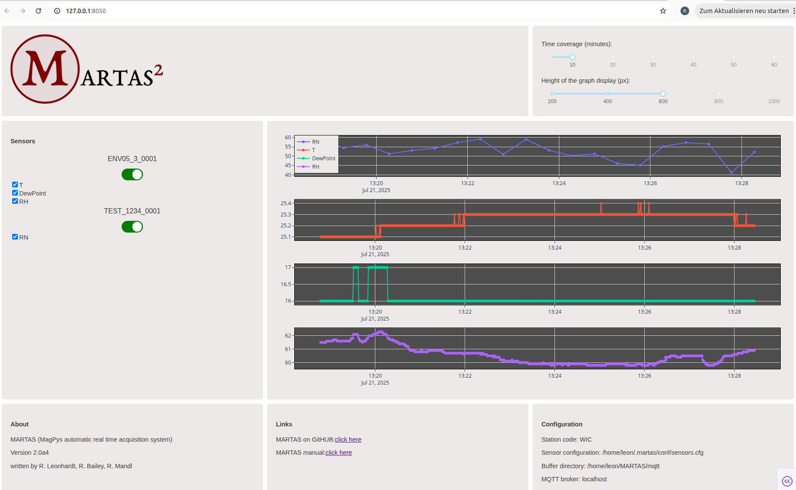
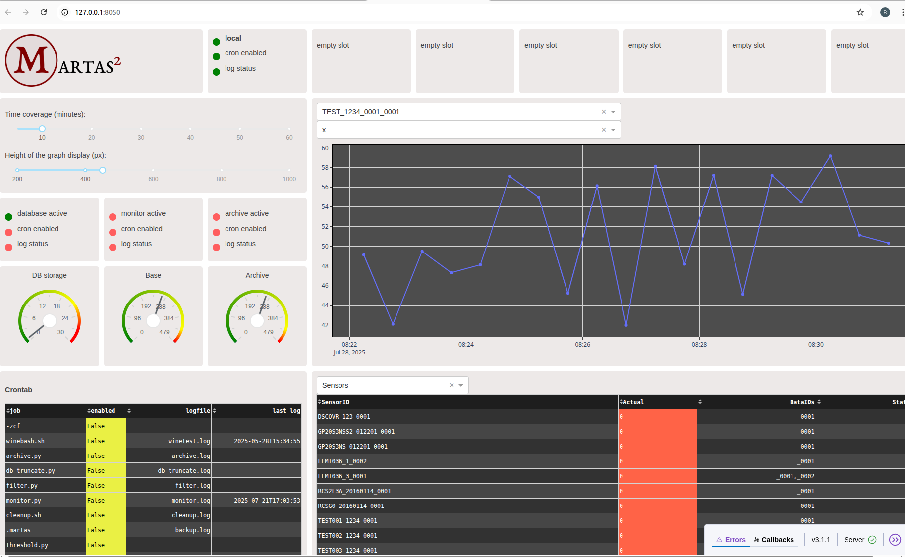

# MARTAS

**MagPys Automated Real Time Acquisition System**


MARTAS is a python package to support uninterrupted realtime data acquisition, secure and reliable realtime data 
transmission and a well organized data collection system, supporting realtime analysis and evaluation. The package 
contains additional functionality for monitoring, data flagging, automated notification systems and archiving. The 
MARTAS package has been specifically developed for high reliability in low-cost environments, making use of minimal 
system requirements and the possibility to be tailored to any specific need. MARTAS has originally been developed to 
support professional observatory networks and contains a number of tools specifically supporting geomagnetic 
observatories. and data sources consisting of timeseries measurements from locally fixed instruments. It can, however, 
also be used for many other sensor networks focusing on timeseries measurements from locally fixed instruments. MARTAS 
is freely available under GNUv3 license. When using MARTAS please cite the software package.   

Developers: R. Leonhardt, R. Mandl, R. Bailey, V. Haberle (GeoSphere Austria)


### Table of Contents

1. [About](#1-about)
2. [Installation](#2-installation)
3. [Initialization of MARTAS/MARCOS](#3-initialization-of-martasmarcos)
4. [MARTAS](#4-martas)
5. [MARCOS](#5-marcos)
6. [Applications](#6-applcations)
7. [Logging and notifications](#7-logging-and-notifications)
8. [Additional tools for flagging and analysis](#8-additional-tools)
9. [Instruments and library](#9-instruments-and-library-)
10. [Appendix](#10-appendix)


## 1. About

## 1.1 The MARTAS concept

MARTAS is a collection of python applications and packages supporting data acquisition, collection, storage, monitoring 
and analysis in heterogeneous sensor environments. The principle idea is providing a unique platform to obtain data 
from sensor interfaces, to stream this data though the internet, and record it within a generalized and open format to 
a data collection system. Previously any system connected via serial interface to a recording computer was registered 
by its own software usually in a company specific format. Intercomparison of such data, extraction of meta information, 
realtime data transport and basically any analysis requiring different sources is significantly hampered.

The package can be initialized for two main processes: **pMARTAS** for data acquisition and **pMARCOS** for data 
collection.
**pMARTAS**: Data acquisition makes use of an instrument library which currently includes many sensors typically used in
observatories around the globe and some development platforms. Basically, incoming sensor data is converted to a 
general purpose data/meta information object which is directly streamed via IOT protocols, namely MQTT 
(message queue transport) to a data broker. 
**pMAROCS**: A data collection system, called MARCOS (MagPys Automated Realtime 
Collector and Organization System), can be setup within the MARTAS environment. MARCOS collection routines can access
MQTT data stream and store/organize such data and meta information in files, data banks or forward them to web sockets.
All data can directly be analysed using [MagPy]() which contains many time domain and frequency domain time series analysis
methods. Each MARTAS process can run independently from the other on the same or different hardware systems. Examples of typical
MARTAS applications are summarized in Figure 1.1.0.




Figure 1.1.0: MARTAS consists of up to three processes which can be separated on different hardwares or combined in all
ways, even on a single machine. pMARTAS is performing data acquisition tasks, publishing data on a MQTT broker. pMARCOS is 
subscribing to the broker, handles analysis, archiving and visualization. pMARCOS also provides tools to transfer data 
to data centers like the INTERMAGNET real time receiver.


MARTAS contains a communication library which supports many commonly used instruments as listed below. With these 
libraries, data AND meta information is obtained from connected sensors. This data is then converted to a MQTT data stream 
containing essential meta information. This data stream has a general format which can be used for basically every 
imaginable timeseries. The data stream is broadcasted/published on a messaging queue transport type (MQTT) broker, a 
state-of-the-art standard protocol of the Internet-of-Things (IOT). A receiver contained in the MARTAS package 
(pMARCOS - MagPy's Automated Realtime Collector and Organization System) subscribes to such data streams and allows to 
store this data in various different archiving types (files (like CDF, CSV, TXT, BIN), databases). Various logging 
methods, comparison functions, threshold tickers, and process communication routines complement the MARTAS package.

Currently supported systems are:

- Lemi025,Lemi036, and most likely all other Lemi systems;
- Geometrics G823 Cs Magnetometers
- GEM Systems GSM-90, GSM-19
- Quantum Magnetometer Systems POS-1, POS-4
- Meteolabs BM35 pressure sensor
- Thiess LaserNiederschlagsMessgerät - Disdrometer
- Ultrasonic Anemometer
- AD7714 general ADC
- Fluke 289 Multimeter
- Campbell Scientific CR800, CR1000 Data logger
- ENV05 Environment sensors
- MySQL/MariaDB databases
- Dallas OneWire Sensors
- DIGIBASE MCA Gamma sensors
- Mingeo ObsDAQ 24bit-ADC in combination with PalmAcq logger
- all data files readable by MagPy

and basically all I2C Sensors and others connectable to Microcontroller boards like [Arduino]()
(requiring a specific serial output format in the microcontroller program - see [9.2.8](#928--communicating-with-an-arduino-uno-microcontroller))

A typical installation of a pMARTAS data acquisition system with a supported sensor is finished within minutes, the
setup of a pMARCOS collection system strongly depends on its complexity and amount of data sources. For both setups 
a single command will guide you through the initialization routine. After installation issue

         $ martas_init

and answer the questions. Then modify the requested configurations and you are done. Nevertheless, please carefully 
read the sections on installation and pMARTAS/pMARCOS specifics. I also spend some time on describing the basic idea,
additional tools and analysis packages, which might be helpful for one or the other.

Note: in the following examples we use "USER" as username and "USERS" as group. Replace these names with your 
user:group names. All instructions assume that you have a profound knowledge of debian like linux systems, as such a 
system is the only prerequisite to run MARTAS.

### 1.2 The MARTAS naming conventions and data model

MARTAS is focusing on instrument level. Each instrument is characterized by its human readable name and its serial 
number. This information provides an unique reference i.e. a LEMI025 sensor with serial number 56 is typically 
denoted as LEMI025_25. To each instrument a revision number is assigned, providing the possibility to track upgrades,
repairs and maintenance. The combination of instrument name, serial number and revision number is referred to as 
**SensorID**, i.e. LEMI025_56_0001. If you are using a pMARCOS collection system with database support, the table SENSORS
will contain all relevant information regarding each SensorID. An instrument like the LEMI025 might record several 
different signals, like three components of geomagnetic field variation, temperatures of electronics and sensor, 
support voltages. These components are referred to as **SensorElements**. For better searchability of the data base it 
is also useful to assign each sensor to a **SensorGroup** (i.e. magnetism), which denotes the primary purpose of the 
instrument and a **SensorType**, which describes the primary physical measurement technique (i.e. fluxgate). The 
individual **SensorElements** however can perform measurements outside the primary group, so each **SensorElement** will
refer to a specific **Field** i.e. temperature probes of LEMI025 will be connected to the field "temperature". An 
instrument is typically setup at a specific location, characterized by its geographical position, a specific 
station name i.e. the observatory, and eventually a specific pier within the station. At this location data is acquired
with the instrument and such data sets are described by the SensorID and a data revision code, referred to as **DataID**
i.e. LEMI025_56_0001_0001. Specific information on each data set is summarized in table DATAINFO referring to the
DataID's. The database will contain pure data tables named by DataID and all acquisition relevant information in 
DATAINFO, including location coordinates and references to station and eventually pier. The station information is 
collected in table STATION, defined by a **StationID** i.e. an observatory defined by its observatory code. Pier 
information might by collected in table PIERS, referring to a specific **PierID**.
 

Figure 1.2.0: An overview about the naming convention. The naming convention is directly used for structuring the 
MARCOS database. Each bold name corresponds to a table within the database. It is strongly recommended to keep the
general structure of the naming convention ( SensorName_SerialNumber_SensorRevision_DataRevision ) even if not using data
base support.


### 1.3 MARTAS users

MARTAS is currently used by many organizations:

Austria: GeoSphere Austria, Conrad Observatory and power grid monitoring networks
Finnland: Image geomagnetic network stations
Colombia: Fuquene geomagnetic observatory
Bulgaria: PAG geomagnetic Observatory

if you are also using MARTAS of any of its modules we would be happy to put yu on the list. 


## 2. Installation

### 2.1 Installation requirements

All installation instructions assume a linux (debian-like) system. Although the core methods of MARTAS are platform 
independent, it is currently only tested and supported on debian-like LINUX systems.

    SYSTEM:
    - mosquitto (MQTT client - broker)
        sudo apt-get install mosquitto mosquitto-clients
    - virtualenvironment (python environment)
        sudo apt-get install virtualenv
    - MAROCS only (if MariaDB is used)
        sudo apt-get install mariadb
        sudo apt-get install percona-toolkit

    PYTHON:
    - python >= 3.7
    - all other requirements will be solved during installation

    Optional python packages:
    - pyownet  (one wire support)
        sudo apt-get install owserver
        pip install pyownet


### 2.2 Installing MARTAS

Please make sure that packages as listed in 2.1 are installed. Then create a python environment:

        $ virtualenv ~/env/martas

or virtualenv -p /usr/bin/python3 ~/env/martas 
Then activate the environment:

        $ source ~/env/martas/bin/activate

Get the most recent MARTAS package:

         download martas-2.x.x.tar.gz

Install the package using pip:

        (martas)$ pip install martas-2.x.x.tar.gz

If you face problems when installing martas within a python environment you can also switch to system python without 
significant problems. Please follow the instructions in section [10.1.1](#1011-installing-martas-with-system-python).

### 2.3 Configure MQTT

Before configuring MQTT it is necessary to ad a few words on how data communication is handled in MARTAS. For more 
details please consult the MQTT literature and network resources. In principle, data communications make use of three
nodes: 

A) a data publisher: typically the pMARTAS acquisition system
B) a broker
C) a data subscriber: typically the pMARCOS collector system

The data publisher (A) is publishing new data on the broker (B). The data subscriber (C) subscribes to the broker 
(B) and receives any new incoming data. A, B and C are separate processes which can be run on a single hardware 
component or on separate computers. By default, the installation of a MARTAS will also install the
broker on the same machine. You can however change that behavior during initialization. 
In the following you will find some instructions on how to get the MQTT broker running on your pMARTAS/pMAROCS machine.

#### 2.3.1 Enable listener

Starting with Mosquitto version 2.0.0 only localhost can listen to mqtt publications. To enable other listener you can
create a config file as follows:

         sudo nano /etc/mosquitto/conf.d/listener.conf

Create this file if not existing and add the following lines:

         listener 1883
         allow_anonymous true

You might also want to increase the message queue. When using the following line within listener.conf Up to 3000 
messages are stored locally in case of network connection issues, and send after reestablishing the connection.

        max_queued_messages 3000

#### 2.3.2 Enabling authentication

Authentication and secure data communication are supported by MARTAS. In order to enable
authentication and SSL encryption for accessing data streams from your acquisition machine please check mosquitto 
instructions to be found on many webpages. A good starting read is [Steves guide](http://www.steves-internet-guide.com/mqtt-security-mechanisms/).

For enabling authentication you firstly need to Add a USER and a password file to the MQTT broker. Replace USER with
your desired username:

        $ sudo mosquitto_passwd -c /etc/mosquitto/passwd USER

You will be asked to provide a password for the USER. Having setup the credentials, you need to reconfigure the 
listener, so that only authenticated requests are allowed. Use command

        $ sudo nano /etc/mosquitto/conf.d/listener.conf

to open the listener configuration file of the broker and insert the following lines. 

        listener 1883
        allow_anonymous false
        password_file /etc/mosquitto/passwd
        max_queued_messages 3000

Restart mosquitto 

        sudo systemctl restart mosquitto

This way you enabled authentication but keep in mind, communication is not yet encrypted. If you have problems 
restarting mosquitto you might want to check the read permissions of the /etc/mosquitto/passwd file.
In order to enable both pMARTAS and pMARCOS to access such protected MQTT data streams you have to use the addcred tool 
in order to avoid plain passwords in your configuration files. To add the MQTT USER/PASSWD information into the 
credentials list of a pMARTAS acquisition unit which also acts as broker use:

        $ addcred -t transfer -c mqttuser -u USER -p MYPASSWD -a localhost

#### 2.3.3 Enabling TLS encryption

In the following you will find an example for a TLS encrypted self-certified setup. We strongly recommend to follow
official mosquitto installation instructions when setting up a secure TLS broker. TLS encryption is recommended if you 
are using an external broker. If your full setup (pMARTAS and pMARCOS are in the same network behind a Firewall) you might 
want to skip TLS encryption.

For our example we firstly create a certificate authority (CA). For SSL connections, the server and client's 
certificates must be signed by a trusted CA. A copy of the CA is stored on the server and the clients. They check 
received certificates against the CA before trusting another device.

We generate a Certificate Authority (CA) Key Pair and Certificate using openssl:

       openssl genrsa -des3 -out ca.key 2048

This command will request a pass phrase. You will need this pass phrase everytime you generate certificates and you 
want to sign them with this CA.

Then we create the actual self-signed CA certificate. This certificate will be used to sign other certificates.

       openssl req -new -x509 -days 3650 -key ca.key -out ca.crt

> [!IMPORTANT]
> Self-signed certificates are suitable for testing but not recommended for production environments. For production, use certificates issued by a trusted Certificate Authority.

Please insert appropriate information into the requested fields. As it is a self-signed certificate I recommend to 
insert the purpose (i.e. OBSCODE MARTAS service) as organization or unit. The Common name should be you full name and
NOT the domain name. The validity is set to 10 years.
The CA certificate is now generated and you should copy it to the dedicated folder of Mosquitto. You will need CA 
certificate file (ca.crt) on pMARTAS, broker and pMARCOS.

       sudo cp ca.crt /etc/mosquitto/ca_certificates/

To generate client certificates on another device, the certificate file and pass phrase are needed.

In a next step we use openssl to create certificates and private keys. One for the server and as many as needed for 
each client. To generate a server key pair and certificate: 

       openssl genrsa -out server.key 2048
       openssl req -new -key server.key -out server.csr

We are also creating a certificate signing request (CSR). Insert country, address, and email address. Note that here, 
every piece of information is about the server, so common name is server domain (the dynamic DNS domain). If you don't 
have one just enter the name of your server there. Then we have to sign the server certificate request:

       openssl x509 -req -in server.csr -CA ca.crt -CAkey ca.key -CAcreateserial -out server.crt -days 3650

Use the CA certificate and key to sign the server certificate request. This creates the server certificate. Then copy
key and certificate to the mosquitto configuration of the server:

       sudo cp server.crt /etc/mosquitto/certs/
       sudo cp server.key /etc/mosquitto/certs/

Clients need to be configured to use the CA certificate for verification. You should provide the CA certificate 
file. In the martas configuration file use the option "mqttcert" and provide a valid path to the  using the "ca.crt" 
file. Enable TLS with "mqttport" : 8883.

An example file for configuring the mosquitto listener is show below:

```
# Global
per_listener_settings true

# Local listener
listener 1883 127.0.0.1

# Default listener
listener 1883
allow_anonymous false
password_file /etc/mosquitto/passwd

# Certificate listener
listener 8883
cafile /etc/mosquitto/ca_certificates/ca.crt
certfile /etc/mosquitto/certs/server.crt
keyfile /etc/mosquitto/certs/server.key
require_certificate false
allow_anonymous false
password_file /etc/mosquitto/passwd
```


#### 2.3.4 Testing MQTT data transfer

Issue the following subscription command:

        mosquitto_sub -h IPADDRESS_OF_MARTAS -t test/#

On a freshly installed MARTAS machine issue the following command:

        mosquitto_pub -h localhost -m "test message" -t test -d

In case you are using a different MQTT broker: change 'localhost' and 'IPADDRESS_OF_MARTAS' with the IP of the BROKER
In case you are using authenticated access use the following additional options:

        mosquitto_pub -h localhost -m "test message" -t test -u USERNAME -P SECRET -d

In case you are using secure TLS access (OS encrypted) use the following additional options:

        mosquitto_pub -h localhost -m "test message" -t test -u USERNAME -P SECRET -p 8883 -d

As soon as you press return at the mosquitto_pub command you should read "test message" below your subscription
command. Checkout the official mosquitto pages for more information.
 
#### 2.3.5 Understanding Quality-of-Service (QOS)

The Quality-of-Service (qos) level is an agreement between the sender of a message and the receiver of a message that 
defines the guarantee of delivery for a specific message. There are three qos levels in MQTT: (0) At most once, (1) At 
least once and (2) Exactly once. (0) sends out data without testing whether it is received or not. (1) sends out data 
and requires an acknowledgement that the data was received. Multiple sendings are possible. (2) makes sure that every 
data is send exactly once. Please refer to MQTT information pages for more details. The amount of messages stored is 
limited, with an upper limit defined by the brokers memory. When using a mosquitto broker the default limit of stored 
messages is 100. In order to change that modify the **max\_queued\_messages** count in mosquitto config.


## 3. Initialization of pMARTAS and pMARCOS

In the following we are setting up MARTAS to acquire measurement data from any connected system, to store it locally
within a buffer directory and to permanenty stream it to a data broker. In the examples, we will use the same pMARTAS 
system as data broker.

### 3.1 Initial setup

Activate the environment if not yet done:

        $ source ~/env/martas/bin/activate

Start the pMARTAS/pMARCOS initialization routine

        (martas)$ martas_init

This routine will ask you a series of questions to configure the acquisition (pMARTAS) or collector (pMARCOS) to your 
needs. In case you want to use e-mail, messenger notifications or database support, make sure that you setup these
tools ideally before running martas_init, and provide credential information using [addcred](https://github.com), section 10.6. 
You might want to checkout [section 6.1](#6-1) for details on notifications and [section 5.3.2](#5-3-2) for database 
support. Please also make sure that you have write permissions on the directories to be used and that those directories
exist already.

The martas_init routine will create a .martas folder and copy some applications into this directory. When updating 
the martas python package, these apps remain unaffected. In order to update the apps you should run martas_init again
with the -u option. If you want to replace an existing martas/marcos installation and reset the contents of all 
configuration files then run the martas_init command with the -r option. By default martaa_init will create a .martas
folder in the uses home directory for storing its data and configurations. You can change this directory by providing
another path (relative to the users homedirectory) using -d. I.e. -d MARTAS will use /home/user/MARTAS as default 
directory.

### 3.2 Inputs during setup

The required inputs are self explaining. Please read the comments and suggestions carefully. Before starting the 
initialization routine make sure that you know what to do, i.e. read the manual. If you did anything wrong you can 
restart/redo initialization anytime using option -r. You will need information about paths, storage directories,
database, communication protocols etc. You can modify anything later by editing the configuration files.

### 3.3 Running pMARTAS/pMAROCS after initialization

Martas_init will update your users crontab and schedule a number of jobs for running the respective module. Typically
the main job will be started shortly after midnight. You might want to issue this command directly after initialization.
Depending on which module (pMARTAS or pMARCOS) you are installing, you will have a series of scheduled applications.
Please checkout the module specific sections for details.

In order to start your desired module directly after initialization use one of the commands (or check 
crontab -l for the exact name) as listed in section 4.2 or 5.2.

## 4. pMARTAS

### 4.1. Quick instructions

Setting up a pMARTAS data acquisition system can be accomplished very quickly, if you already have some experience.

**Step 1**: initialize pMARTAS using martas_init (details on [martas_init](#3-initialization-of-martasmarcos)) 

        (martas)$ martas_init

**Step 2**: update/insert sensor information in sensors.cfg (details in [section 4.2](#42-defining-and-configuring-sensors)) 
 
        (martas)$ nano ~/.martas/conf/sensors.cfg

**Step 3**: start pMARTAS (details in [section 4.5](#45-running-the-acquisition-system)). Actually MARTAS will be 
started automatically after some time.

        (martas)$ cd ~/.martas
        (martas)$ bash -i runmartas.sh start

**Step 4**: view pMARTAS acquisition (details in [section 4.6](#46-the-martas-viewer)) 

        (martas)$ cd ~/.martas
        (martas)$ bash martas_view

Open webpage http://127.0.0.1:8050

### 4.2 Defining and configuring sensors

#### 4.2.1 The sensors.cfg configuration file

When initialization is finished there is only one further step to do in case of a pMARTAS acquisition machine. You need 
to specify the sensors. For this you will have to edit the sensors configuration file.

        $ nano ~/.martas/conf/sensors.cfg

sensors.cfg is the basic configuration file for all sensors connected to the pMARTAS system. It contains a line with a 
comma separated list for each sensor which looks like:

        GSM90_6107631_0001,S1,115200,8,1,N,passive,gsm90v7init.sh,-,1,GSM90,GSM90,6107632,0002,-,AS-W-36,GPS,magnetism,GEM Overhauzer v7.0

You will find a number of examples for supported sensors in section 4.6. The following elements are contained in this 
order:

| element      | description | example |
|--------------| -------- | ---------- |
| sensorid     | Unique identification string for sensor. Ideally consisting of  fields "name\_serialnumber\_revision" | GSM90\_6107631\_0001 |
| port         | serial communication port (e.g. tty**S1** or tty**USB0**)  |  S1 |
| baudrate     | Serial communication baudrate | 115200 |
| bytesize     | Serial communication bytesize | 8 |
| stopbits     | Serial communication stopbits | 1 |
| parity       | Parity can be set to none (N), odd (O), even (E), mark (M), or space (S) | N |
| mode         | Can be active (data requests are send) and passive (sensor sends data regularly)  | passive |
| init         | Sensor initialization (see 3.4 and appendix 10.1)  | gsm90v7init.sh |
| rate         | Defines the sampling rate for active threads in seconds (integer). Data will be request with this rate. Active threads with more than 1 Hz are not possible. Not used for passive modes. | - |
| stack        | Amount of data lines to be collected before broadcasting. Default **1**. **1** will broadcast any line as soon it is read. | 1 |
| protocol     | MARTAS protocol to be used with this sensor |  GSM90 |
| name         | Name of the sensors   | GSM90 |
| serialnumber | Serialnumber of the sensor  | 6107632 |
| revision     | Sensors revision number, i.e. can change after maintainance  | 0002 |
| path         | Specific identification path for automatically determined sensors. Used only by the OW protocol. | - |
| pierid       | An identification code of the pier/instrument location  | AS-W-36 |
| ptime        | Primary time originates from NTP (MARTAS clock), GNSS, GPS. If the sensors delivers a timestamp e.g. GPS time, then a generated header input **DataTimesDiff** always contains the average difference to the MARTAS clock, in this case GPS-NTP  | GPS |
| sensorgroup  |  Diszipline or group  | magnetism |
| sensordesc   |  Description of sensor details | GEM Overhauzer v7.0 |


> [!IMPORTANT]  
> sensorids should only contain basic characters like 0,1,2,..9,a,b,...,z,A,B,...,Z (no special characters, no underscors, no minus etc)
> sensorids should not contain the phrases "data", "meta" or "dict"
> sensorids should follow the [naming](#11-the-martasmarcos-naming-conventions-and-data-model) convention

Further details and descriptions are found in the commentary section of the sensors.cfg configuration file.

#### 4.2.2 Obtaining parameters for sensors.cfg

Sensors.cfg requires a number of parameters for proper communication. Please consult the sensor specific article in
[section 4.4](#44-examples-for-sensor-definitions-in-sensorscfg) for supported systems and the manual of your sensor.
In addition you will need to provide connection details, in particular the port of the device. The following linux
commands will help you to identify the ports. If you connect you system to a real serial port, the number should be 
written next to the port. In case of USB connections, also when using serial-to-usb converters, you will find out the 
connection as follows. 

The command *lsusb* will give you an overview about USB connections. When issuing this command before and after you 
attach a serial-to-usb device you will find out the name and type of this device.

        $ lsusb

In order to get the corresponding device port (i.e.ttyUSB0) you can use the following command.

        $ dmesg | grep usb

### 4.3 Sensors requiring initialization

Several sensors currently supported by pMARTAS require an initialization. The initialization process defines e.g. 
sampling rates, filters, etc. in a way that the sensor systems is automatically sending data to the serial port 
afterwards. pMARTAS supports such initialization routines by sending the respective and necessary command sequence to 
the system. Initialization commands are stored within the pMARTAS configuration directory (Default: ~/.martas/init).
The contents of the initialization files for supported instruments is outlined in Appendix 10.1. In order to use such
initialization, you need to provide the path within the sensors configuration line in sensors.cfg:

sensors.cfg: line for a GSM90 Overhauser, the initialization configuration is taken from gsm90v7init.sh (within the 
martas config directory)

        GSM90_6107631_0001,S1,115200,8,1,N,passive,gsm90v7init.sh,-,1,GSM90,GSM90,6107632,0002,-,AS-W-36,GPS,magnetism,GEM Overhauzer v7.0


### 4.4 Examples for sensor definitions in sensors.cfg

#### Geomagnetic GSM90 Overhauser Sensors (GEM Systems)

         GSM90_6107631_0001,S1,115200,8,1,N,passive,gsm90v7init.sh,-,1,GSM90,GSM90,6107632,0002,-,AS-W-36,GPS,magnetism,GEM Overhauzer v7.0

It is suggested to use the sensor name GSM90, the serial number of the electronics unit and a 4 digit revision number 
of your choice i.e. 0001. The revision number should be changed in case of electronic units maintainance etc. GSM90 
sensors require initialization data provided in ~/.martas/init i.e. gsm90v7init.sh (see [9.2.1](#921-gem-systems-overhauser-gsm90), 
to start continuous recording of the system. I strongly recommend passive recording i.e. at 0.5 Hz (GPS mode) and then
filter to 1 Hz to obtain a record with readings centered on the second.

#### Geomagnetic GSM19 Overhauzer Sensors (GEM Systems)

        GSM19_7122568_0001,USB0,115200,8,1,N,passive,,-,1,GSM19,GSM19,7122568,0001,-,mobile,GPS,magnetism,GEM Overhauzer v7.0

The GSM19 sensor needs to be configured so that it sends data to the serial port (see [9.2.2](#922-gem-systems-overhauser-gsm19)).

#### Geoelectric 4point light 10W (Lippmann)  

        4PL_123_0001,ACM0,19200,8,1,N,active,None,60,1,FourPL,4PL,123,0001,-,Home,NTP,geoelectric,wenner-0.65-0-c-o

Provide layout (wenner,schlumberger,half-schlumberger,dipole-dipole,), Distances A and L, as well as current and 
frequency within the comment part. For currents and frequencies please refer to the following codes:

currdic = {"m":"1uA","n":"10uA","o":"100uA","p":"1mA","q":"5mA","r":"15mA","s":"50mA","t":"100mA"}
freqdic = {"a":"0.26Hz","b":"0.52Hz","c":"1.04Hz","d":"2.08Hz","e":"4.16Hz","f":"8.33Hz","g":"12.5Hz","h":"25Hz"}

wenner-0.65-0-c-o  :  wenner configuration with electrode distance A of 0.65m, L=0 is not used for wenner, current (c) = 100uA, and frequency (o) = 1.04 Hz


#### Meteorology DSP Ultrasonic wind (Meteolab)  

         ULTRASONICDSP_0009009195_0001,S0,115200,8,1,N,active,None,60,1,DSP,ULTRASONICDSP,0009009195,0001,...

#### General Adruino microcontroller (Arduino)  

Please read section [9.2.7](#927--communicating-with-an-arduino-uno-microcontroller).

         ARDUINO1,ACM0,9600,8,1,N,active,None,60,1,ActiveArduino,ARDUINO,-,0001,-,Home,NTP,environment,getO-getU

#### MariaDB/MySQL database access  

A database link needs to be created using **addcred**. This shortcut, *cobsdb* in belows example, is used to connect
the database. Data is obtained with the given sampling rate (10 seconds below). Only tables belonging to SensorGroup
"magnetism" are listed. Please note that you also should update **timedelta** in *martas.cfg*, as this parameter is
defining how old data is allowed to be considered.

         cobsdb,-,-,-,-,-,passive,None,10,1,MySQL,MySQL,-,0001,-,-,-,magnetism,-

#### Onewire Senors (Dallas)  

The following additional packages need to be installed:

         sudo apt install owfs 
         pip install pyownet

Please also read section [9.2.6](#926-dallas-ow-one-wire-support) for configuration details.

         OW,-,-,-,-,-,active,None,10,1,Ow,OW,-,0001,-,A2,NTP,environment,environment: dallas one wire sensors

#### Environment ENV05 T/rh ()

         ENV05_3_0001,USB0,9600,8,1,N,passive,None,-,1,Env,ENV05,3,0001,-,AS-W-20,NTP,environment,temperature and humidity

#### Geomagnetic LEMI025/036 variometer (LEMI LVIV)

         LEMI036_3_0001,USB0,57600,8,1,N,passive,None,-,1,Lemi,LEMI036,3,0001,-,ABS-67,GPS,magnetism,magnetic variometer from Lviv

#### Geomagnetism POS1/POS4 Overhauser Sensor (Quantum magnetics)

         POS1_N432_0001,S0,9600,8,1,N,passive,pos1init.sh,-,1,POS1,POS1,N432,0001,-,AS-W-36,GPS,magnetism,Quantum magnetics POS1 Overhauzer sensor

#### Datalogger CR1000/CR800 (Campbell Scientific)

You need to install a Campbell python library in order to use this datalogger:

         cd ~/Downloads/
         git clone git://github.com/SalemHarrache/PyCampbellCR1000.git
         cd PyCamp*
         python setup.py install

Then you can use the following line in sensors.cfg

         CR1000JC_1_0002,USB0,38400,8,1,N,active,None,2,1,cr1000jc,CR1000JC,02367,0002,-,TEST,NTP,meteorological,snow height

#### Datalogger AD7714 24bit ()

         AD7714_0001_0001,-,-,-,-,-,autonomous,None,-,10,ad7714,AD7714,-,0001,-,-,NTP,environment,24bit analog digital converter

#### Multimeter Fluke 289

         FLUKE289_24580003_0001,USB0,115200,8,1,N,active,None,0.1,10,fluke289,FLUKE289,24580003,0001,-,TEST,NTP,electric,voltage

#### Geomagnetic Obsdaq/Palmdaq datalogger together FGE Magnetometer (MINGEO, DTU)

         FGE_S0252_0002,USB0,57600,8,1,N,passive,obsdaqinit.sh,-,1,obsdaq,FGE,S0252,0002,-,ABS-67,GPS,magnetism,magnetic fluxgate from Denmark

#### Data files (supported are all data files, readable with MagPy)

         WICadjusted,/home/leon/Cloud/Daten,-,-,-,-,active,None,30,1,IMfile,*.min,-,0001,-,-,-,magnetism,-


### 4.5 Running the acquisition system

Please note: the steps described within this section have already been preconfigured during martas_init. You can 
manually change and re-configure anytime.

#### 4.5.1 Manual start

        (martas)$ cd ~/.martas
        (martas)$ bash -i runmartas.sh start

The following options are now available:

        (martas)$ bash -i runmartas.sh status
        (martas)$ bash -i runmartas.sh start
        (martas)$ bash -i runmartas.sh stop
        (martas)$ bash -i runmartas.sh restart

#### 4.5.2 Automatic schedule

The MARTAS start command is included into the users crontab during the initialization process of martas_init. Therefore
the acquisition job will be started automatically depending on the schedule of the crontab (default is around midnight,
once a day). The process will only be started in case it is not yet running.


### 4.6 The pMARTAS viewer

Since MARTAS version 2.0 a pMARTAS viewer is included. The viewer will create a local webpage giving you some information
about the MARTAS system, its connected sensors and data. You can start and open the pMARTAS viewer as follows: 

        (martas)$ cd ~/.martas
        (martas)$ bash martas_view

Open webpage http://127.0.0.1:8050 will give you something like:


Figure 4.6.1: The pMARTAS viewer provides a quick overview about live data, connected sensors, and some configuration
information. In this example two sensors are connected, one of which is a testing device. The available recorded 
elements are shown on the left side, a "live" image of acquired data is shown on the right side. On the upper right
you can modify the live display.

### 4.7 Additional setups

The initialization process will also schedule a number of additional jobs for your pMARTAS machine, which you can 
modify and/or disable. It also some applications for you eventually might want to enable.

#### 4.7.1 Cleanup of buffer memory

Principally, all data is buffered in binary files, by default within the /home/USER/MARTAS/mqtt directory. 
You can also mount any external storage medium like a SD card or external memory to be used as bufferdirectory. By 
default the buffer memory is handled as some kind of ring-buffer, which only contains data covering a certain timerange. 
Old data is continuously replaced by new data, preventing a buffer overflow. This is done by the configurable cleanup
routine, which has been automatically added and activated in your crontab by the initialization process. 

By default, the cleanup routine will remove local buffer files older than 100 days and local MARTAS backups older then
60 days. You might want to change these values, but at least consider them for remote backups. 


#### 4.7.2 Regular backups of all MARTAS configurations

MARTAS comes with a small [backup application](#64-backup) to be scheduled using cron, which saves basically all MARTAS configuration
files within a zipped archive. The aim of this application is to save all essential information within one single data
file so that in case of a system crash (hardware problem, SD card defect, etc) you can easily and quickly setup an 
identical "new" system. You might also use the backups to setup similar copies of a specific system.
A backup of your MARTAS configuration is automatically scheduled once a week during initialization.

#### 4.7.3 Monitoring pMARTAS acquisition

Also scheduled during automatic initialization is a basic [monitoring routine](#612-monitor), which makes use of the given 
notification method, provided that this method is properly configured. The basic monitoring process will watch 
your disk sizes for buffer memory, the martas logfile for errors and the actuality of the buffer files. Changing states
or critical remaining disk sizes will issue messages. The martas logfile, typically to be found in ~/.martas/log, will
be subject to logrotate, in order to prevent an overflow. 

#### 4.7.4 Warning messages with threshold tester

The [threshold](#621-threshold) testing routine is prepared and preconfigured but NOT enabled. In order to do so, adept the parameters
of the configuration file and activate it in crontab.

### 4.8 Checking runtime performance and/or troubleshooting

A few hints in order to test for proper recording and data publication.

1) Check the log files, typically to be found in ~/.martas/log/martas.log

2) Check the buffer file actuality, i.e. ls -al ~/MARTAS/mqtt/YOURSENSORID/

3) Check MQTT publication

           mosquiito_sub -h BROKER -t STATIONID/#

### 4.8. Using MARTAS to publish geomagnetic data on INTERMAGNET

MARTAS can be used to transfer geomagnetic data to the MQTT receivers of INTERMAGNET directly. The MQTT service is hosted 
at BGS and an overview can be found [here](https://github.com/INTERMAGNET/wg-www-gins-data-formats/tree/master/ImagMQTT). 
MARTAS supports an INTERMAGNET style MQTT real-time data transport for (1) for MagPY databases continuously filled by 
MARCOS jobs (ideal way if you use MARTAS/MagPy for data production)
and (2) by periodically accessing local data files, which are readable by MagPy. This applies to basically all data formats
used in geomagnetism. File contents are transformed into delivery packages. This is done by implementing a 
virtual sensor in sensors.cfg pointing either to a database or a file-directory. Both ways are described in detail 
below. Setting up such data delivery is very simple and quickly accomplished. Section 4.8.1 will summarize all steps
required to setup and configure data delivery to the BGS. Section 4.8.2 will outline specific virtual sensor details 
for database usage, 4.8.3 will describe the usage of a file directory structure.

#### 4.8.1 Getting access to the MQTT Broker and local configurations

Before setting up a MQTT - IMTERMAGNET delivery system please carefully read the manual provided by the BGS. 
Then install martas as outlined in section 2. Do not run martas_init yet. Request your authentication credentials from
the BGS personnel. You will need a username, which usually is your observatory code, and a password and specify the 
publication channel. This channel should be pne of the following:

INTERMAGNET observtory:    gin-mqtt.bgs.ac.uk
Test observatory:  gin-mqtt-staging.bgs.ac.uk

After acquiring this information create an credential input on your pMARTAS computer:

        addcred -t transfer -c bgsmqtt -u XXX -p PASSWD -a 

Replace XXX with your lower case observatory code and replace PASSWD with the password you obtained from BGS.
Then run

        martas_init

The following questions need to be answered with the bold inputs. For all other inputs you can choose the default 
values. 

MQTT port: **8883**
MQTT authentication: **bgsmqtt**


#### 4.8.2 Delivering data from a MARCOS/MagPy data base

This technique supports realtime transmission of variation data and very near time delivery of adjusted data products. 
Basically two steps are required. (1) produce the submission files within your database i.e. following the adjusted 
data in section 8. (2) assign the SensorGroup "service" to these data sets within table SENSORS.

Then you modify sensors.cfg by activating the data base as virtual sensor. Assuming a database name "mydatabase" your 
input into sensors.cfg would look like:

        mydatabase,-,-,-,-,-,active,None,120,1,MySQL,MySQL,-,0001,-,-,-,service,-

Using this command, all tables belonging to the SensorGroup "service" will be tested for new data every 120 seconds. New
data will be send via MQTT to INTERMAGNET. If you have i.e. two tables, one with one-minute and one with one-second data,
both assigned to group "service" contents of both tables will be send with the correct topics.

#### 4.8.3 Delivering data from local data files

The technique can be applied to all data sets which are readable by MagPy2.0. The only thing to do is to specify 
the directory, file name structure and upload rate within sensors.cfg. The upload rate, 120 seconds in the example below, 
hereby defines the time period at which the file structure is tested for new data. If no new data is found it will just
send the last existing value. Otherwise it will send all new data since the last upload. The first field, SensorID,
should contain a unique name like XXXadjustedmin, the second field needs to specify the directory, where to find
data files. The protocol is "IMfile" and the field after the protocol need to contain the file extension, *.min in the
example below. 

        XXXadjustedmin,/home/USER/Cloud/Data,-,-,-,-,active,None,120,1,IMfile,*.min,-,0001,-,-,-,magnetism,-

In case you are using a subdirectory structure like /toplevel/year/month/*.min then please insert '/toplevel' within 
the directory field and a file identifier like '**/*.min'. For an additional data source like one-second *.sec data you 
will have to add a separate line into sensors.cfg. Please note: this technique always reads the last two files within
the directory structure according to their creation data. Then it extracts data related to the expected coverage of 
the upload rate. 

#### 4.8.4 Running and testing MQTT publication on the BGS INTERMAGNET server

Check the martas.cfg file within the config directory. The payload format should be *intermnagnet*, the mqtt parameters
need to be correct.

After finishing the martas_init command, a starting script is generated and scheduled to be started in crontab. You can 
now start it manually for testing:

       cd ~/.martas
       bash runmartas.sh start

Using basic mosquitto commands you can test the data transmission. In the following example we are testing submissions
to the Test Observatory channel. Please again replace the three occurrences of XXX with you lower case observatory code
i.e. wic  and replace PASSWD with the password you git from BGS.

        mosquitto_sub -h gin-mqtt-staging.bgs.ac.uk -t impf/XXX/# -u XXX_r -P PASSWD -p 8883 -v -d -i XXX

When you are finished with that you can start data submission as outlined in 4.8.2 or 4.8.3. You will receive the data 
structure you send in std.out. You might also want to activate debug : True within the martas.cfg file for more detailed
information on delivery.


## 5. MARCOS

### 5.1. Quick instructions

In the following we are setting up MARCOS to collect measurement data from a broker. MARCOS subscribes to the broker 
and receives any new data published there. All three systems, pMARTAS, BROKER, and pMARCOS can run on the same machine 
as different processes. You can also have several MARCOS collectors accessing the 
same broker independently.

**Step 1**: Setup database, create paths for archives and add credentials depending on your projected destination ([section 5.4](#54-data-destinations))

**Step 2**: initialize a MARCOS collector using martas_init (details on [martas_init](#3-initialization-of-martasmarcos)) 

        (martas)$ martas_init

You will have to provide a name for the collection job. I recommend to use the hostname of the broker/acquisition 
machine. In the following I use MYJOB1 as an example name.

**Step 3**: eventually review/update configurations (details in [section 5.2](#52-marcos-specific-configurations))

The initialization routine will setup a number of scheduled jobs for backup, monitoring, database management, and 
archiving. It will prepare jobs for filtering and threshold testing.

**Step 4**: Run the collection job (details in [section 5.3](#53-running-a-collection-job)) 
 
        $ bash collect-MYJOB1.sh update #(important for first time usage with database - see below)

The collection job will also start automatically around midnight.

**Step 5**: For adding further collection jobs repeat steps 2 and 4

**Step 6**: Eventually setup schedules analyses like flagging, adjusted data preparation and DI analysis ([section 8.1](#81-analysispy-for-continuous-flagging-adjustedquasidefinitive-data-products-and-status-information-))


### 5.2 MARCOS specific configurations

MARCOS subscribes to the data broker and obtains published data depending on the selected "topic". You can select 
whether this data is then stored into files (binary buffer files, supported by MagPy), into a data base (mariadb, mysql)
and/or published on a webserver. You can also select multiple destinations. These selections are done during
initialization. As outlines above it is important to know these destinations already before initializing MARCOS 
and provide credentials using MagPys addcred method. No further configurations are necessary.

#### 5.2.1 archive

see [section 6.10](#610-filter)

#### 5.2.2 monitoring

see [section 6.12](#612-monitor)

#### 5.2.3 database management

see [section 6.7](#67-db_truncate) and [section 6.14](#614-optimizetables) 

#### 5.2.4 backup

see [section 6.4](#64-backup)

#### 5.2.5 optional filter

see [section 6.10](#610-filter)

#### 5.2.6 optional threshold

see [section 6.21](#621-threshold)

### 5.3 Running a collection job

After initialization you will find a bash job with the selected name (i.e. myjon) within your .martas directory.  You 
can start this job manually as follows.:

        $ bash collect-MYJOB1.sh start 

The following options are now available:

        $ bash collect-MYJOB1.sh start 
        $ bash collect-MYJOB1.sh stop 
        $ bash collect-MYJOB1.sh restart 
        $ bash collect-MYJOB1.sh status
        $ bash collect-MYJOB1.sh update #(important for first time usage with database - see below)

Please note: if database output is selected then by default only the data table will be written. If you want to 
create/update DATAINFO and SENSOR information, which usually is the case when running the sensor collection job for the
first time then run the collector with the "update" option, at least for a few seconds/minutes.

        $ bash collect-MYJOB1.sh update 

### 5.4 Data destinations

#### 5.4.1 Saving incoming data as files

Select destination "file" during initialization. You will also have to provide a file path then. Within this file path
a directory named with the SensorID will be created and within this directory daily binary files will be created 
again with SensorId and date as file name. The binary files have a single, ASCII readable header line describing its 
packing formats. These binary files can be read with MagPy and transformed into any MagPy supported format.

#### 5.4.2 Streaming to a database

Checkout the MagPy instructions to setup and initialize a MagPy data base
(see [section 9](https://github.com/geomagpy/magpy/tree/develop?tab=readme-ov-file#9-sql-databases)). 
This is usually done within minutes and then can be readily used for pMARCOS data collections or pMARTAS dissemination. 
When initializing MARCOS and selecting destination "db" you will need to provide a credential shortcut for the 
database. You can create such credentials using addcred. Use addcred -h for all options.

      $ addcred -d db -c mydb -u user -p secret -h localhost

Please use the "update" option when running a job with a new sensor for the first time to create default inputs into the
database (and not only the data table).

#### 5.4.3 Streaming to a web interface

Select destination "websocket"

Open the following page in a webbrowser
        http://ip_of_marcos:8080


a) Starting websocket transfer on MARCOS from commandline

      Manually you can also do that as follows:
        $ cd ~/MARTAS
        $ python collector -d websocket -o mystation
      If authentication is used:
        $ python collector -d websocket -o mystation -u user -P password

b) Accessing websocket
      Connect to the MATRTAS machine from remote:
      On any machine which can access defined websocket port you can now open
      the following url in a browser of your choice:
      (Pleas replace "ip_of_martas" with the real IP-address or url name.

        http://ip_of_martas:8080

c) Customizing the WEB interface/ports of MARCOS

   - Modifying ports and paths - modify marcos.cfg
        $ python collector -m /path/to/marcos.cfg
      Here you can change default port (8080) and many other parameters.

   - Customizing graphs and layout (will change in the near future)
      Modify smoothiesettings.js:
        $ nano ~/MARTAS/web/smoothiesettings.js


#### 5.4.4 Writing to stdout

When selecting destination "stdout" the ASCII output will be written to the destination defined by logging. This can 
either be sys.stdout or the given log file. 

#### 5.4.5 Selecting diff as destination

Calculates real-time differences between sensors attached to the same MARTAS. This is useful if you want to 
visualize gradients directly.


### 5.5 The MARCOS viewer

Since MARTAS version 2.0 a MARCOS viewer is included. The viewer will create a local webpage giving you some information
about the MARCOS collection system. Please note that this viewer is specifically developed for a datbase based collection
system. You can start and open the MARCOS viewer as follows: 

        (martas)$ cd ~/.martas
        (martas)$ bash marcos_view

Open webpage http://127.0.0.1:8050 will give you something like:


Figure 5.5.1: The MARCOS viewer provides a quick overview about collection jobs (top), live data (center right), 
database, archive and monitoring state plus storage consumption (center left), as well as scheduled jobs (bottom left) and
sensors, data records in the database (table right). 


## 6. Applications

### 6.1 Overview of applications

MARTAS comes along with a number of application scripts to support data acquisition, collection of data, access of 
remote data sources and organizations tools for databases. All these scripts can be found within the directory 
MARTAS/apps. Below you will find a comprehensive list of these scripts and their purpose. In the following you will 
find subsections with detailed instructions and example applications for all of these programs.


| Script           | Purpose                                              | Config        | Version | Section |
|------------------|------------------------------------------------------|---------------|---------|---------|
| archive.py       | Read database tables and create archive files        | archive.cfg   | 2.0.0*  | 6.2     |
| ardcomm.py       | Communicating with arduino microcontroller           |               | 1.0.0   | 6.3     |
| backup.py        | Backup configuration                                 |               | 2.0.0   | 6.4     |
| basevalue.py     | Analyse mag. DI data and create adopted baselines    | basevalue.cfg | 2.0.0   | 6.5     |
| checkdatainfo.py | List/ad data tables not existing in DATAINFO/SENS    |               | 2.0.0*  | 6.6     |
| db_truncate.py   | Delete data from all data tables                     | truncate.cfg  | 2.0.0*  | 6.7     |
| file_download.py | Download files, store them and add to archives       | collect.cfg   | 2.0.0*  | 6.8     |
| file_upload.py   | Upload files                                         | upload.json   | 2.0.0*  | 6.9     |
| filter.py        | filter data                                          | filter.cfg    | 2.0.0   | 6.10    |
| gamma.py         | DIGIBASE gamma radiation acquisition and analysis    | gamma.cfg     |         | 6.11    |
| monitor.py       | Monitoring space, data and logfiles                  | monitor.cfg   | 2.0.0*  | 6.12    |
| obsdaq.py        | Communicate with ObsDAQ ADC                          | obsdaq.cfg    | 2.0.0*  | 6.13    |
| optimzetables.py | Optimize table disk usages (requires ROOT)           |               | 2.0.0*  | 6,14    |
| palmacq.py       | Communicate with PalmAcq datalogger                  | obsdaq.cfg    | 2.0.0*  | 6.15    |
| serialinit.py    | Sensor initialization uses this method               |               | 2.0.0*  | 6.16    |
| speedtest.py     | Test bandwidth of the internet connection            |               | 2.0.0*  | 6.17    |
| statemachine.py  | Currently under development - will replace threshold |               | 1.0.0   | 6.18    |
| testnote.py      | Send a quick message by mail or telegram             |               | 2.0.0*  | 6.19    |
| testserial.py    | test script for serial comm - development tool       |               | 1.0.0   | 6.20    |
| threshold.py     | Tests values and send reports                        | threshold.cfg | 2.0.0   | 6.21    |

Version 2.0.0* means it still needs to be tested

### 6.2 archive

Archive.py gets data from a databank and stores it to any accessible repository (e.g. disk). Old database entries 
exceeding a defined age can be deleted in dependency of data resolution. Archive files can be stored in a user defined 
format. The databank size is automatically restricted in dependency of the sampling rate of the input data. A 
cleanratio of 12  will only keep the last 12 days of second data, the last 720 days of minute data and approximately 
118 years of hourly data are kept. Settings are given in a configuration file.
> [!IMPORTANT]  
> data bank entries are solely identified from DATAINFO table. Make sure that your data tables are contained 
there.

> [!IMPORTANT]  
> take care about depth - needs to be large enough to find data. Any older data set (i.e. you uploaded data 
from a year ago) will NOT be archive and also not be cleaned. Use db_truncate to clean the db in such cases.

        # Automatic application
        python3 archive.py -c ~/.martas/conf/archive.cfg

        # Manual for specific sensors and time range
        python3 archive.py -c ~/.martas/conf/archive.cfg -b 2020-11-22 -s Sensor1,Sensor2 -d 30

The configuration file will be initialized using martas_init. Additional changes and options are available.

        nano ~/.martas/conf/archive.cfg

provides credentials, path, defaultdepth, archiveformat, writearchive, applyflags, cleandb, cleanratio
and lists and dictionaries to modify criteria for specific sensors:
sensordict      :    Sensor1:depth,format,writeDB,writeArchive,applyFlags,cleanratio;
blacklist       :    BLV,QUAKES,Sensor2,Sensor3,


### 6.3 ardcomm

Communication program for microcontrollers (here ARDUINO) e.g. used for remote switching commands

### 6.4 backup

The backup routine will be scheduled automatically within the martas_init routine. *backup* creates a 
backup of all configuration files and settings. These backups can be used to recover a pMARTAS/pMARCOS system quickly.
Recovery is widely independent of hardware and software versions. To recover a broken MARTAS system you would perform
the following steps:

1) Perform all installations steps of section 2
2) Then run: python ...app/backup.py -r /path/to/backup_mymachine_DATE.zip

Thats it... You can also use this routine to clone existing MARTAS installations to new machines.

Backups are created by default on a weekly basis and you might want to store them on a different storage device. 
Eventually use file_upload for this purpose.


### 6.5 basevalue

Basevalue.py (re)calculates basevalues from DI measurements and provided variation and scalar data. The method can use 
multiple data sources and piers as defined in the configuration file. It further supports different run modes defining
the complexity of baseline fits, application of rotation matricies etc. These run modes are used for the yearly 
definitive data analysis of the Conrad Observatory. It is recommended to use a similar data coverage of approximately one year
particularly with polynomial or spline fits to get comparable fitting parameters. In default mode: if
enddate is set to now and no startdate is given, then startdate will be 380 days before enddate. 

For continuous application throughout the year, i.e. an automatic DI analysis of new input values and a continuous 
calculation of an adopted baseline the following parameters are suggested.

        python basevalue.py -c ~/.martas/conf/basevalue.cfg

For definitive data analysis, verification of baselines, iterative optimization of adopted baselines, and validation of 
multiple pier measurements, you can use very same method with a combination of different run modes (option -j). 
Instructions will be added gradually here. Meanwhile contact the Conrad Observatory team if you have questions.

The basevalue application, in particular its overview plotting method, currently has some limitations as it was developed
for DHZ baselines and might not display XYZ data correctly. 

### 6.6 checkdatainfo

checkdatainfo.py checks for all data tables which are missing in DATAINFO  and SENOSRS. This method helps to 
identify any data tables which are continuously filled, but not available in XMagPy and which are not treated by
archive. This also means that these tables are not frequently trimmed in size. Use db_truncate to trim those tables.

Options:
-c (required) : credentials for a database
-i            : data table identifiers - end of table name i.e "00??" (? can be numbers from 0-9)
-d            : check datainfo
-s            : check sensors
-a            : add missing data to DATAINFO ( if "-d") and SENSORS (if "-s")

Example:

        python checkdatainfo.py -c cobsdb -d -s


### 6.7 db_truncate

db_truncate.py truncates contents of timesseries in a MagPy database. Whereas "archive" also allows for truncating 
the database (based on DATAINO) "db\_truncate" removes contents from all tables of xxx\_xxx\_xxxx\_xxxx structure.
(independent of DATAINFO contents).
The databank size is automatically restricted in dependency of the sampling rate of the input data. A cleanratio of 12
will only keep the last 12 days of second data, the last 720 days of minute data and approximately 118 years of hourly 
data are kept. Settings are given in a configuration file.

Application:

        python3 db_truncate.py -c archive.cfg


### 6.8 file_download

Downloads data by default in to an archive "raw" structure like /srv/archive/STATIONID/SENSORID/raw
Adds data into a MagPy database (if writedatabase is True)
Adds data into a basic archive structure (if writearchive is True)
The application requires credentials of remote source and local database created by addcred

   1) Getting binary data from a FTP Source every, scheduled day
    python3 collectfile-new.py -c ../conf/collect-ftpsource.cfg
    in config "collect-ftpsource.cfg":
             sourcedatapath        :      /remote/data
             filenamestructure     :      *%s.bin

   2) Getting binary data from a FTP Source every, scheduled day, using secondary time column and an offset of 2.3 seconds
    python3 collectfile-new.py -c ../conf/collect-ftpsource.cfg
    in config "collect-ftpsource.cfg":
             sourcedatapath        :      /remote/data
             filenamestructure     :      *%s.bin
             LEMI025_28_0002       :      defaulttimecolumn:sectime;time:-2.3

   3) Just download raw data to archive
    python3 collectfile-new.py -c ../conf/collect-ftpsource.cfg
    in config "collect-ftpsource.cfg":
             writedatabase     :      False
             writearchive      :      False

   4) Rsync from a ssh server (passwordless access to remote machine is necessary, cred file does not need to contain a pwd)
    python3 collectfile-new.py -c ../conf/collect-ftpsource.cfg
    in config "collect-ftpsource.cfg":
             protocol          :      rsync
             writedatabase     :      False
             writearchive      :      False

   5) Uploading raw data from local raw archive
    python3 collectfile-new.py -c ../conf/collect-localsource.cfg
    in config "collect-localsource.cfg":
             protocol          :      
             sourcedatapath    :      /srv/archive/DATA/SENSOR/raw
             writedatabase     :      False
             writearchive      :      True
             forcerevision     :      0001

      
### 6.9 file_upload

Upload data to a destination using various different protocols supported are FTP, SFTP, RSYNC, SCP. Jobs are listed in 
a json structure and read by the upload process. You can have multiple jobs. Each job refers to a local path. Each job
can also have multiple destinations.

Examples:
1. FTP Upload from a directory using files not older than 2 days
```
{"graphmag" : {"path":"/srv/products/graphs/magnetism/","destinations": {"conradpage": { "type":"ftp", "path" : "images/graphs/magnetism/"} },"log":"/home/leon/Tmp/Upload/testupload.log", "extensions" : ["png"], "namefractions" : ["aut"], "starttime" : 2, "endtime" : "utcnow"}}
```
2. FTP Upload a single file
```
{"graphmag" : {"path":"/home/leon/Tmp/Upload/graph/aut.png","destinations": {"conradpage": { "type":"ftp", "path" : "images/graphs/magnetism/"} },"log":"/home/leon/Tmp/Upload/testupload.log"}}
```
3. FTP Upload all files with extensions
```
{"mgraphsmag" : {"path":"/home/leon/Tmp/Upload/graph/","destinations": {"conradpage": { "type":"ftp", "path" : "images/graphs/magnetism/"} },"log":"/home/leon/Tmp/Upload/testupload.log", "extensions" : ["png"]} }
```
4. Test environment
```
{"TEST" : {"path":"../","destinations": {"homepage": { "type":"test", "path" : "my/remote/path/"} },"log":"/var/log/magpy/testupload.log", "extensions" : ["png"], "starttime" : 2, "endtime" : "utcnow"} }
```
5. RSYNC upload
```
{"ganymed" : {"path":"/home/leon/Tmp/Upload/graph/","destinations": {"ganymed": { "type":"rsync", "path" : "/home/cobs/Downloads/"} },"log":"/home/leon/Tmp/Upload/testupload.log"} }
```
6. JOB on BROKER
```
{"magnetsim" : {"path":"/home/cobs/SPACE/graphs/","destinations": {"conradpage": { "type":"ftp", "path" : "images/graphs/magnetism/"} },"log":"/home/cobs/Tmp/testupload.log", "extensions" : ["png"], "namefractions" : ["magvar","gic_prediction","solarwind"], "starttime" : 20, "endtime" : "utcnow"}, "supergrad" : {"path":"/home/cobs/SPACE/graphs/","destinations": {"conradpage": { "type":"ftp", "path" : "images/graphs/magnetism/supergrad"} },"log":"/home/cobs/Tmp/testupload.log", "extensions" : ["png"], "namefractions" : ["supergrad"], "starttime" : 20, "endtime" : "utcnow"},"meteo" : {"path":"/home/cobs/SPACE/graphs/","destinations": {"conradpage": { "type":"ftp", "path" : "images/graphs/meteorology/"} },"log":"/home/cobs/Tmp/testupload.log", "extensions" : ["png"], "namefractions" : ["Meteo"], "starttime" : 20, "endtime" : "utcnow"}, "radon" : {"path":"/home/cobs/SPACE/graphs/","destinations": {"conradpage": { "type":"ftp", "path" : "images/graphs/radon/"} },"log":"/home/cobs/Tmp/testupload.log", "extensions" : ["png"], "namefractions" : ["radon"], "starttime" : 20, "endtime" : "utcnow"}, "title" : {"path":"/home/cobs/SPACE/graphs/","destinations": {"conradpage": { "type":"ftp", "path" : "images/slideshow/"} },"log":"/home/cobs/Tmp/testupload.log", "extensions" : ["png"], "namefractions" : ["title"]}, "gic" : {"path":"/home/cobs/SPACE/graphs/","destinations": {"conradpage": { "type":"ftp", "path" : "images/graphs/spaceweather/gic/"} },"log":"/home/cobs/Tmp/testupload.log", "extensions" : ["png","gif"], "namefractions" : ["24hours"]}, "seismo" : {"path":"/home/cobs/SPACE/graphs/","destinations": {"conradpage": { "type":"ftp", "path" : "images/graphs/seismology/"} },"log":"/home/cobs/Tmp/testupload.log", "extensions" : ["png"], "namefractions" : ["quake"]} }
```

Application:

   python3 file_uploads.py -j /my/path/uploads.json -m /tmp/sendmemory.json

Problem:
 - upload is not performed and stops already at first input. The log file contains "DEALING with ...", "file upload app finished", "SUCCESS"
Solution:
 - this error is typically related to an empty memory file


### 6.10 filter

Use the filter application to smooth and resample data sets. The methods uses the MagPy filter method and allows
for the application of all included filter methods (https://github.com/geomagpy/magpy/tree/develop?tab=readme-ov-file#5-timeseries-methods).
By default only data sets with sampling periods faster than 1 Hz will be filtered. You can change this behavior
you with input options.
The filter method principally supports two run modes using option -j, **realtime** and **archive**, of which realtime 
is the default mode. For the application of the **realtime** mode a MagPy database is mandatory. **archive** requires an
archive structure as obtained by the archive.py application. Both run modes require 
a configuration file. The configuration file is a json structure containing a filter dictionary with the following 
sub items:

| item           | description                                                                        |
|----------------|------------------------------------------------------------------------------------|
| groupparameter | a dictionary with filter characteristics of specific sensors or data groups        |
| permanent      | a list of sensors subjected to *realtime* analysis                                 | 
| blacklist      | a list of SensorIDs which should not be filtered although belonging to data groups |
| basics         | a dictionary with general definition, paths and notification                       |

Groupparameter contains subdictionaries of the following format:

         {...,
         "LEMI036_3_0001_0001" : {"filtertype":"hann", 
                                  "filterwidth":100, 
                                  "missingdata":"conservative",
                                  "resample_period":1, 
                                  "window" : 40000, 
                                  "dayrange":4,
                                  "station" : "WIC",
                                  "revision" : "0002"},
         "LEMI025" : {"filtertype":"gaussian"} 
         }

The groupparameter item can either be a unique DataID, a SensorID or any fraction of those name. "LEMI025" will define
a group and apply the filter parameters to all DataIDs containing "LEMI025". The content of each groupparameter is also
organized as a dictionary. The following items can be defined for each group entry. *station* will limit the application
to data sets from this obs-code/IMO/station. *filtertyp*, *filterwidth* and *missingdata* define
the major filter characteristics. Please check MagPy's help(DataStream().filter) for all available filters and their
parameters. *resample_period* is given in Hz. If you want skip resampling then insert "noresample". *window* defines 
the amount of data on which the filter is applied in 
**realtime** mode. If you want to subject the last 600 seconds of 10Hz data, then window should be 6000. *realtime* is 
deprecated and will be removed. *dayrange* defines the data range to be filtered in **archive** mode. *revision* defines
the DataID revision assigned to the output. Usually this is "0002".
Please note: any parameter defined in groupparameter will override defaults and general values provided as options like
-d dayrange. 

The permanent item defines a list of realtime sensors. Only these DataID's are considered for realtime analysis.

The blacklist item is a list of data sets to be ignored. 

Basics provides a dictionary with general information.

              "basics": {"basepath":"/home/user/MARCOS/archive",
                         "outputformat":"PYCDF",
                         "destination":"db",
                         "credentials":"mydb",
                         "notification":"telegram",
                         "notificationconf":"/home/user/.martas/conf/telegram.cfg",
                         "logpath":"/home/user/.martas/log/filterstatus.log"}


The filter application will firstly scan the database for all DataIDs defined as *grouparameter* items fulfilling the 
sampling rate criteria, below 1 Hz as default, and drop all DataID's as defined in the *blacklist*.
A **realtime** job will then check whether recent data recordings exist, which by default are not older then 7200 sec, 
2 hours. Then it will will perform a filter analysis using the given parameters. 
A **archive** job will use the dayrange parameter, default is 2, and option endtime, default is UTC-now. Endtime can 
only be modified using the general option -e.

        python filter.py -c ~/myconfig.cfg -j archive -e 2024-11-22

The output will be stored within the defined destination. Please note: if a database is your destination then DATAINFO
is updated. Data sets are stored within the data table ending with the provided revision, default 
"0002". Other general options are -l to define a loggernamse, which is useful if you have several filter jobs running on one
machine. The option -x will enable sending of logging information to the defined notification system. By default 
this is switched of because database contents are usually monitored, which also would report failures with 
specific data sets. 

The filter method should be applied in an overlapping way, as the beginning and end of the filtered sequence are
removed in dependency of the filter width. 

 
### 6.11 gamma

Working with Spectral radiometric data: The gamma script can be used to extract spectral measurements, reorganize the 
data and to analyze such spectral data as obtained by a DIGIBASE RH.

Prerequisites are a DIGIBASE MCA and the appropriate linux software to run it.
1) Please install linux drivers as provided and described here:
   https://github.com/kjbilton/libdbaserh

2) Use a script to measure spectral data periodically (almost 1h)

        #!/bin/bash
        DATUM=$(date '+%Y-%m-%d')
        SN=$(/home/pi/Software/digibase/dbaserh -l | grep : | cut -f 2)
        NAME="/srv/mqtt/DIGIBASE_16272059_0001/raw/DIGIBASE_"$SN"_0001.Chn"
        /home/pi/Software/digibase/dbaserh -set hvt 710
        /home/pi/Software/digibase/dbaserh -q -hv on -start -i 3590 -t 3590 >> $NAME

3) Use crontab to run this script every hour

        0  *  *  *  *  root  bash /home/pi/Software/gammascript.sh > /var/log/magpy/gamma.log

4) use gamma.py to extract spectral data and store it in daily json structures

        58 5   *  *  *  root  $PYTHON /home/pi/SCRIPTS/gamma.py -p /srv/mqtt/DIGIBASE_16272059_0001/raw/DIGIBASE_16272059_0001.Chn  -c /home/pi/SCRIPTS/gamma.cfg -j extract,cleanup -o /srv/mqtt/DIGIBASE_16272059_0001/raw/ > /var/log/magpy/digiextract.log  2>&1

4) use gamma.py to analyse spectral data and create graphs

        30 6   *  *  *  root  $PYTHON /home/pi/SCRIPTS/gamma.py -p /srv/mqtt/DIGIBASE_16272059_0001/raw/ -j load,analyze -c /home/pi/SCRIPTS/gamma.cfg  > /var/log/magpy/digianalyse.log 2>&1


### 6.12 monitor

It is possible to monitor most essential aspects of data acquisition and storage. Monitor allows for testing data 
actuality, get changes in log files, and/or get warnings if disk space is getting small. Besides, monitor.py can
be used to trigger external scripts in case of an observed "CRITICAL: execute script." state. This, however, is only
supported for logfile monitoring in case of repeated messages. 
The following jobs are supported, provided usually as joblist within the monitor.cfg configuration file:

1. **space** - testing for disk size of basedirectory (i.e. /srv/mqtt or srv/archive)
2. **martas** - check for latest file updates in basedirectory and subdirs
3. **datafile** - check for latest file updates only in basedirectory, not in subdirs
4. **marcos** - check for latest timestamp in data tables
5. **logfile** - log-test-types are: new or repeat, last, contains; new -> logfile has been changed since last run; repeat -> checks for repeated logsearchmessage in changed logs if more than tolerance then through execute script msg; last -> checks for logsearchmessage in last two lines; contains -> checks for logsearchmessage in full logfile

The monitor configuration file will be initialized by martas_init.

Application:

        python3 monitor.py -c ~/.martas/conf/monitor.cfg

### 6.13 obsdaq and palmacq

Richard, please...


### 6.14 optimizetables

Optimizing tables and free space, the unblocking version. Please note, executing this job requires root privileges

REQUIREMENTS:
 - magpy
 - sudo apt install percona-toolkit
 - main user (user/cobs) needs to be able to use sudo without passwd (add to /etc/sudoers)

### 6.16 serialinit

Serialinit is used by all initialization jobs. See init folder...  


### 6.17 speedtest

Perform a speedtest based on speedtest-cli (https://www.speedtest.net/de/apps/cli)

        sudo apt install speedtest-cli

Application:
        python3 speedtest.py -n speed_starlink01_0001

If you want to run it periodically then add to crontab:

        */5  *  *  *  *  /usr/bin/python3 /path/to/speedtest.py -c /path/to/conf.cfg -n speed_starlink01_0001  > /dev/NULL 2&>1

### 6.18 statemachine

See threshold. Statemaschine is currently developed and may replace threshold in a future version.


### 6.19 testnote

Send notifications via email and telegram. testnote.py will create a log file with a message. Whenever, the logfile 
content (message) is changing, a notification will be send out to the defined receiver. In order to use notifications, 
please install addapps.

OPTIONS:

        -m            : message to be send
        -n            : notification type: email, telegram or log
        -c            : path to configuration file
        -l            : key value of the log dictionary (value will be the message)
        -p            : path to the logfile (will contains a dictionary)

APPLICATION:

        python3 testnote.py -n email -m "Hello World" -c /etc/martas/mail.cfg -l TestMessage -p /home/user/test.log
        python3 testnote.py -n telegram -m "Hello World, I am here" -c /etc/martas/telegram.cfg -l TestMessage -p /home/user/test.log
        python3 testnote.py -n log -m "Hello World again" -l TestMessage -p /home/user/test.log

> [!IMPORTANT]  
> A message is only created if contents are changing. So typically you have to call testnote twice. First, send a message like "Wold", then send "Hello World". This technique is used to report changing states only.

### 6.20 testserial

Simple test code for serial communication. Not for any productive purpose.

### 6.21 threshold

The threshold application can be used to check your data in realtime and trigger certain action in case a defined 
threshold is met. Among the possible actions are notifications by mail or messenger, switching command to a connected
microcontroller, or execution of bash scripts. This app reads data from a defined source: pMARTAS buffer files, 
pMARCOS database or any file supported by [MagPy] (eventually directly from MQTT). Within a configuration file you 
define threshold values for contents in this data sources. Notifications can be triggered if the defined criteria are
met, and even switching commands can be send if thresholds are broken. All threshold processes can be logged and  can 
be monitored independently by mail, nagios, icinga, telegram.
Threshold.py can be scheduled in crontab. 

In case you are using telegram notifications please note that these notification routines are independent of an 
eventually used TelegramBot ([section 7.4]()) for communication with your MARTAS machine. 
You can use the same channel, however.

Threshold requires a configuration file which is setup during the initialization process with [martas_init] 
and the application needs to be scheduled in crontab. In order to test specific data sets you will have to modify the
test parameters in the configuration file by providing a list of sensorid; timerange to check; key to check, value, 
function, state, statusmessage, switchcommand(optional).
SensorID, key:  if sensorid and key of several lines are identical, always the last valid test line defines the message
                 Therefore use warning thresholds before alert thresholds
Function:       can be one of max, min, median, average(mean), stddev
State:          can be one below, above, equal
Statusmessage:  default is replaced by "Current 'function' 'state' 'value', e.g. (1) "Current average below 5"
                 the following words (last occurrence) are replace by datetime.utcnow(): date, month, year, (week), hour, minute
                 "date" is replaced by current date e.g. 2019-11-22
                 "month" is replaced by current month e.g. 2019-11
                 "week" is replaced by current calender week e.g. 56
                 "minute" looks like 2019-11-22 13:10
                 -> "date" changes the statusmessage every day and thus a daily notification is triggered as long a alarm condition is active

> [!IMPORTANT]  
> statusmessage should not contain semicolons, colons and commas; generally avoid special characters


1) Testing whether 1Hz data from column x of sensor "MYSENS_1234_0001" exceeded a certain threshold of 123 in the last 
10 minutes. Send the defined default message to the notification system as defined in the config file. 

1  :  MYSENS_1234_0001;600;x;123;max;above;default

2) Testing whether 1Hz data from column x of sensor "MYSENS_1234_0001" exceeded on average 123 in the last 
10 minutes. Send a message like "warning issued at 2019-11-22".

2  :  MYSENS_1234_0001;600;x;123;average;above;alarm issued at date

3) Testing whether the standard deviation of 1Hz data from column x of sensor "MYSENS_1234_0001" exceeds on 2 in the last 
10 minutes. Send a message like "found flapping states".

3  :  MYSENS_1234_0001;600;x;2;stddev;above;flapping state

4) Testing whether the median 1Hz data from column x of sensor "MYSENS_1234_0001" exceeds a threshold of 123 in the last 
10 minutes. Send the defined default message to the notification system as defined in the config file. Send a "switch"
command to a connected microcontroller if this state is reached.

4  :  MYSENS_1234_0001;600;x;123;median;above;default;swP:1:4


## 7. Notifications and advanced monitoring

### 7.1 Setting up e-mail notifications


In order to setup e-mail notifications two steps need to be performed. Firstly, ideally done before running 
martas_init, you should add the credentials for the outgoing mail server using MagPys *addcred* method. For this 
purpose you will need the smtp mailserver details and its port. Supported by MARTAS are the often used ports 25, 465 
and 587.

        addcred -t mail -c webmail -u info@mailservice.at -p secret -s smtp.mailservice.at -l 25

Then you will need to update the mail.cfg configuration file.

        nano ~/.martas/conf/mail.cfg

The mail credential reference has already been updated during configuration. You might want to update the mail 
receivers however. 

Testing your configuration is possible with the application [testnote.py](#619-testnote).

        python ~/.martas/app/testnote.py -n email -m "Hello" -c ~/.martas/conf/mail.cfg -l TestMessage -p /home/user/test.log

Please note: calling testnote the first time will create the log file but don't send anything. From then on, a message
will be send whenever you change the message content.

        python ~/.martas/app/testnote.py -n email -m "Hello World" -c ~/.martas/conf/mail.cfg -l TestMessage -p /home/user/test.log


### 7.2 Setting up Telegram notifications

Notification send with the [Telegram] messenger are supported by MARTAS. For this purpose you will need to setup a 
Telegram BOT and link it to a private message channel, then add the BOTs token and a chat_id into the telegram.cfg 
configuration file. 

Step-by-step instructions:

1) Create a bot: Use BotFather to create a new bot and obtain its token. 

2) Add the bot to your channel: Add your newly created bot as an administrator to the Telegram channel or group. 

3) Send a message: Send a message to the channel from any user. 

4) Get the chat ID:
Open the getUpdates URL in your browser, replacing <YOUR_BOT_TOKEN> with your bot's token: https://api.telegram.org/bot<YOUR_BOT_TOKEN>/getUpdates. 

The JSON response will contain an array of updates. Find the update related to your message.
Within that update, locate the chat object. The id field within the chat object is your channel's chat ID. 
Note the chat ID: Remember that for channel chat IDs, you'll often see a negative number, often starting with -100. For
example, the chat ID might look like -1001234567890. 

5) Insert token and chat_id into the telegram.cfg file.


Then you can use [testnote.py](#619-testnote) for testing whether its working (you must run this command two times with 
a different message).

        python ~/.martas/app/testnote.py -n email -m "Hello" -c ~/.martas/conf/mail.cfg -l TestMessage -p /home/user/test.log
        python ~/.martas/app/testnote.py -n email -m "Hello World" -c ~/.martas/conf/mail.cfg -l TestMessage -p /home/user/test.log


### 7.3 Permanent real time visualization

The [martas_viewer](#46-the-martas-viewer) is a nice tool to get a quick picture of data streams. It is however not 
build for permanent realtime visualization. For memory efficient,  long term "real-time" 
graphs, a couple of additional tools is available. These tools require the setup of a MARCOS machine and websocket
communication.

| Content                 | Description                                                      |
| -------------------------|------------------------------------------------------------------|
|  **web**                 | Webinterface as used by the collector with destination websocket |
|  web/index.html          | local main page                                                  |
|  web/plotws.js           | arranging plots of real time diagrams on html page               |
|  web/smoothie.js         | plotting library/program (http://smoothiecharts.org/)            |
|  web/smoothiesettings.js | define settings for real time plots                              |


### 7.4 Monitoring pMARTAS and pMARCOS

#### 7.4.1. monitor.py

After setup of the communication/notification scheme you can refer to [section 6.x](#612-monitor) for a MARTAS 
monitoring setup. 

### 7.4.2 Support for NAGIOS/ICINGA

Beside the internal monitoring routines you might want to include your pMARTAS/pMARCOS environment into a high end 
monitoring network. Please checkout Icinga and/or NAGIOS for this purpose. MARTAS can be easily included into such
networks and instructions are available upon request.

```
#NAGIOS
sudo nano /etc/nagios/nrpe.cfg
# MARTAS/MagPy commands:
# -----------------
command[check_procs_martas]=/usr/lib/nagios/plugins/check_procs -c 1:1 -C python -a acquisition
command[check_all_disks]=/usr/lib/nagios/plugins/check_disk -w 20% -c 10% -e -A -i '.gvfs'
command[check_log]=/usr/lib/nagios/plugins/check_log -F /home/USER/.martas/log/martas.log -O /tmp/martas.log -q ?

# NTP check (optional)
#command[check_ntp_time]=/usr/lib/nagios/plugins/check_ntp_time -H your.ntp.server -w 1 -c 2
```


### 7.5 Two-way communication with MARTAS

#### 7.5.1 The TelegramBot

MARTAS comes with a small communication routine, the TelegramBot, which allows interaction with the MARTAS server. 
In principle, you can chat with MARTAS and certain keywords will trigger reports, health stats, data requests, and many
more. Communication routines are available for the [Telegram] messenger. In order to use these routines you need to
setup a Telegram bot, referring to your MARTAS.

TelegramBot provides a communicaton tool with remote computers through the messenger app "Telegram". This tool is 
specifically designed for communication with data acquisition computers, based on MagPy's Automatic Real Time 
Acquisition System (MARTAS). This bot allows for interacting with those machines, obtain important system information, 
health status, and information on connected sensors. You can check data acquisition, plot timeseries and more.
Provided a appropriate sensor configurations it is also possible to use the system as a remote switch, you can attach
a cameras and trigger messaging events.

TelegramBot is a background service permanently running on your machine. You will need to install the following 
additional package which is not on the default requirement list.

      pip install telepot


#### 7.5.2 Installation and interactive communication with TelegramBot

To setup 2-way [Telegram] communication use the following steps:

##### a) Use [Telegram Botfather] to create a new BOT

        /newbot

        /setuserpic

##### b) Install Telegram support for MARTAS

        pip install telepot

The installer will eventually add the following apckages: telepot, psutil and
platform. For webcam support you shoudl install fswebcam.

        sudo apt install fswebcam  # optional - transferring webcam pictures


#####  c) Update ~/.martas/conf/telegrambot.cfg

        nano ~/.martas/conf/telegrambot.cfg

- you need the BotID, which you obtained when creating the new BOT
- you need at least one UserID. Your UserID

#####  d) Open Telegram on your Mobile/Webclient and access the TelegramBot Channel.

You can can now talk to your BOT (here are some examples):

        hello bot

        i need help

        what sensors are connected

        give me some details on sensors DS18B20

        i need further details on sensor

        please provide your current status

        i would like to get some system information

        get the log of the telegrambot, last 20 lines

        please restart the martas process

        please restart the marcos process

        plot data from DS18B20_28616411B2648B6D_0001

        plot data from DS18B20_28616411B2648B6D_0001 between 2020-10-24 and 2020-10-26

If you have a microcontroller connected, programmed with MARTAS specifications (e.g. arduino) you can also send switching commands:

        switch heating on

There are further options which require additional system settings. If you want the remote user be able to reboot the 
system you will need to enable this for the MARTAS user. You will need to modify /etc/sudoers and insert the MARTAS USER.
Replace USER by your MARTAS user.
```
# user is allowed to execute reboot 
USER ALL=NOPASSWD: /sbin/reboot
```
You also might need to add the following line to your .bashrc

         export PATH=$PATH:/sbin


## 8. Additional tools

### 8.1 analysis.py for continuous flagging, adjusted/quasidefinitive data products and status information 

#### 8.1.1 MartasAnalysis

For continuous flagging of data in a MARCOS environment you can use the MartasAnalysis class as follows. Flagging 
configurations need to be supplied to the method in form of json data. An example of such flagging configuration 
information is given here

```
flagdict = {'TEST': {"coverage": 86400,
                     "keys": ['x','y','z'],
                     "mode": ['outlier'],  # outlier, range, ultra, ai,
                     "samplingrate": 1,
                     "min": -59000,
                     "max": 50000,
                     "addflag": True,
                     "threshold": 4,
                     "window": 60,
                     "markall": True,
                     },
                     ...
            }
```

This dictionary provides details on the Sensor or SensorGroup and the applied flagging method. The "TEST" refers to 
the SensorID of datasets to be flagged. All SensorIDs containing TEST in their name will be flagged with the given
parameters (i.e. TEST_1234_0001, TEST001_XXX_0002, AWSOME_TEST_0001). The last 86400 datapoint will be read and 
outlier flagging (despiking) be performed using threshold and window.

> [!IMPORTANT]  
> the methods of the analysis module are designed to work with a MagPy/MARTAS database. Using the methods on
non-DB architectures will need some work to adjust the methods. Methods and Classes of the analysis module are typically
scheduled using cron.

Typical application for continuous flagging looks as follows. The periodically method will read data, remove already 
existing flags and then apply the flagging method on remaining data.

        from martas.core import methods as mm
        from martas.core.analysis import MartasAnalysis
        config = mm.get_conf('Configuration file like basevalue.cfg')
        config = mm.check_conf(config)
        flagdict = mm.get_json('Flagdict file like shown above')
        mf = MartasAnalysis(config=config, flagdict=flagdict)
        fl = mf.periodically(debug=False)
        suc = mf.update_flags_db(fl, debug=True)

Other flagging related methods are upload, archive, cleanup.

In order to obtain adjusted or quasidefinitive data, the MartasAnalysis class contains methods specifically designed for 
geomagnetic data analysis. Adjusted data can be obtained hereby.


        from martas.core import methods as mm
        from martas.core.analysis import MartasAnalysis
        config = mm.get_conf('Configuration file like basevalue.cfg')
        config = mm.check_conf(config)
        mf = MartasAnalysis(config=config)
        primary_vario = mf.get_primary(variometer DataID list)
        primary_scalar = mf.get_primary(scalar DataID list)
        merged = mf.magnetism_data_product('adjusted', primary_vario, primary_scalar)
        results = merged.get('merge')
        for samplingrate in results:
            mf.db.write(results.get(samplingrate))

If you have multiple variometers on your site the get_primary method investigates supplied variometer data sets and
selects the first one of the list which contains valid data. The method *magnetim_data_products* will then read data,
eventually remove flags, apply offsets as defined in the database, perform a baseline correction and construct merged 
data sets. If one-second data is supplied it will also create a filtered one-minute record. 


#### 8.1.2 MartasStatus

MartasStatus is used to extract specific values from the data sets. This method can be used to supply status information
and current values to webpages and services. The kind of status information is defined in a dictionary which might be
stored as json file on your system. 

```
statusdict = {"Average Temperature of TEST001": {
                                "source": "TEST001_1234_0001_0001",
                                "key": "x",
                                "type": "temperature",
                                "group": "tunnel condition",
                                "field": "environment",
                                "location": "gmo",
                                "pierid": "",
                                "range": 30,
                                "mode": "mean",
                                "value_unit": "°C",
                                "warning_high": 10,
                                "critical_high": 20
                                },
                     ...
            }
```

THe keys of each status element refer to the following inputs:

| key           | description                          | default                  | example     |
|---------------|--------------------------------------|--------------------------|-------------|
| source        | DataID                               | -                        | -           |
| key           | column of DataID                     | x                        | t1          |
| field         | physical property contained in key   | -                        | temperature |
| group         | primary purpose of Instrument/Sensor | SensorGroup              | magnetism   |
| type          | specific primary sensor type         | SensorType               | fluxgate    |
| pierid        | reference to pier                    | PierID                   | A2          |
| station       | reference to StationID               | StationID                | WIC         |
| longitude     |                                      | DataAcquisitionLongitude | -           |
| latitude      |                                      | DataAcquisitionLatitude  | -           |
| altitude      |                                      | DataElevation            | -           |
| range         | timerange in minutes                 | 30                       | 30          |
| mode          | mean,median,max,min,uncert           | mean                     | fluxgate    |
| value_unit    | unit of key                          | unit-col-KEY             | -           |
| warning_low   | lower warning level                  | 0                        | -5          |
| warning_high  | upper warning level                  | 0                        | 10          |
| critical_low  | lower critical level                 | 0                        | -20         |
| critical_high | upper critical level                 | 0                        | 20          |


The key values of each status element contained in the status dictionary need to be unique and are ideally human 
readable. The subdictionary defines parameters of the data set to be extracted. Typically recent data covering the 
last "range" minutes are extracted and the value as defined by mode (mean, median, max, min, uncert) is obtained. If 
no data is found the "active" value of the return dictionary is set to 0. Most properties are obtained from existing
tables in the database. You can override database contents by providing the corresponding inputs within the status
elements. Please note: the physical property "field" is not contained in the database and can only be supplied here.

As all other methods, the MartasStatus class methods are designed for data base usage. You can extend your MagPy data
base with a status information tables using the following command:

        from martas.core import methods as mm
        from martas.core.analysis import MartasStatus
        config = mm.get_conf('Configuration file like basevalue.cfg')
        config = mm.check_conf()
        statusdict = mm.get_json('Statusdict file like shown above')
        ms = MartasStatus(config=config, statusdict=statusdict,tablename='COBSSTATUS')

        initsql = ms.statustableinit(debug=True)

Status messages in this table can then be updated by scheduling a job like the following

        ms = MartasStatus(config=config, statusdict=statusdict,tablename='COBSSTATUS')
        sqllist = []
        for elem in ms.statusdict:
            statuselem = ms.statusdict.get(elem)
            res = ms.read_data(statuselem=statuselem,debug=True)
            warnmsg = ms.check_highs(res.get('value'), statuselem=statuselem)
            newsql = ms.create_sql(elem, res, statuselem)
            sqllist.extend(newsql)


### 8.2 definitive.py for geomagnetic definitive data production

The definitive module contains a number of methods for geomagnetic definitive data analysis. It is currently part of 
MARTAS2.0 and uses the same configuration data as basevalue. Please note that this module was specifically developed 
for the Conrad Observatory and some of the methods will only be useful for very similar procedures. The module contains
methods for analyzing variometer and scalar data. The methods are designed for an iterative analysis of one-second data,
allowing for optimization of baseline adoption. Filtered one-minute products are generated.
Following the data treatment philosophy of MagPy data from different sensors is treated separately,

Please note: for a general application some of the methods will need to be updated. I included this module anyway, as 
it might turn out to be useful for others, although it can not readily be applied in a general form.

#### 8.2.1 variocorr

Using variocorr one can analyse the variation data of several instruments, apply flagging information, eventually apply 
transformations, rotations and offsets, and perform baseline adoption. Three different application levels are supported 
for an iterative analysis: firstrun, secondrun and thirdrun. Firstrun will use a simple average baseline, whereas 
secondrun and thirdrun support complex baseline fits. The application of bias fields (also called compensation fields), 
rotation angles (Euler rotation) and flagging information can be varied between runs. By default the method requires 
a full year of one second data of one or multiple instruments and baseline data files for each sensor. Data will be 
treated in monthly chunks. The method can also be used for single day analysis by providing the date in 
config['testdate']. The method returns monthly MagPyCDF data files containing raw data, flagging info and 
baseline function, i.e. data files which contain basically every information to review IM variation and produce IM
definitve data.
Variocorr will always return rotation angles between measured field components and a magnetic coordinate system as 
obtained by DI data. In case of an optimal DHZ oriented system these angles are zero. 

#### 8.2.2 variocomb

Variocomb is used to create a merged variation data set from multiple variometer records. The order of instruments in 
the configuration files is used to define primary, secondary, ... systems. Baseline corrected data from variocorr is 
then used to construct a joint record with gaps filled in minute resolution. Variocomb can also read scalar products 
from 8.1.3 and create definitive minute products as requested by INTERMAGNET/IAGA. Definitve second products have to 
be constructed from outputs of variocomb and scalarcomb in a separate step.

#### 8.2.3 scalarcorr and scalarcomb

For scalar data the two methods to the same job as similar methods for variometers, without baseline adoption. Please
note, complex F baseline require a different approach currently not supported by these methods. Currently only constant
offsets are supported. Joint data sets are supported for both minute and second data.

#### 8.2.4 create_rotation

Take the return of variocorr and add rotation data into the database so that average yearly rotations can be considered
for analysis (leading to baseline jumps every year). 

#### 8.2.5 pier_diff

Used to determine F differences of multiple piers provided that a mobile reference sensor is used regularly to measure on 
all these piers. This is very Conrad Observatory specific and you might want to contact the Cobs Team for details.  

#### 8.2.6 dissemination: definitive_min and definitive_sec

Creates geomagnetic dissemination data by producing the corresponding data formats and contents from the MagPy files
obtained by above methods. Created are IAGA, IAF and ImagCDF (in minute and second resolution).

#### 8.2.7 dissemination: activity_analysis

Performs an analysis of geomagnetic activity

#### 8.2.8 dissemination: blv

Creates INTERMAGNET baseline format files and includes all required information into these files.


### 8.3 Useful commands during runtime

acquisition process still running?  

              bash /home/USER/.martas/runmartas status

check log file contents

              tail -30 /home/USER/.martas/log/martas.log

Are buffer files written

              ls -al /home/USER/MARTAS/mqtt/YOURSENSOR/

Can I subscribe to the MQTT data stream (MQTTBROKER might be localhost, etc) 

              mosquitto_sub -h MQTTBROKER -t TOPIC/#

Can I publish data to a broker?

              mosquitto_pub -h MQTTBROKER -t TOPIC -m "Hello"

 collector process running?  

          bash /home/USER/.martas/collect-JOBNAME status

log file contents

          tail -30 /home/USER/.martas/log/collect-JOBNAME.log

data files/ database  written

          DATABASE:
          mysql -u user -p mydb
          select * from DATATABLE order by time desc limit 10;

          FILE:
          ls -al /my/file/destination/


## 9. Instruments and library 

### 9.1 Sensor communication libraries

Principally all libraries should work in version 2.0.0 although only tested libraries contain the new version number.

| Instrument          | versions | Inst-type   | Library                  | mode     | init           | requires         |
|---------------------|----------|-------------|--------------------------|----------|----------------|------------------|
| Arduino             |          | multiple    | activearduinoprotocol.py | active   |                |                  |
| AD7714              |          | multiple    | ad7714protocol.py        | active   |                |                  |
| Arduino             |          | multiple    | arduinoprotocol.py       | passive  |                |                  |
| BM35-pressure       |          | pressure    | bm35protocol.py          | passive  | bm35init.sh    |                  |
| BME280              |          | pressure    | bme280i2cprotocol.py     | passive  |                | adafruit_bme280  |
| CR1000/800          |          | multiple    | cr1000jcprotocol.py      | active   |                | pycampbellcr1000 |
| Cesium G823         |          | opt.pumped  | csprotocol.py            | passive  |                |                  |
| Thies LNM           |          | laserdisdro | disdroprotocol.py        | active   |                |                  |
| DSP Ultrasonic wind |          | wind        | dspprotocol.py           | active   |                |                  |
| ENV05               | 2.0.0    | temperature | envprotocol.py           | passive  |                |                  |
| FLUKE 289           | 2.0.0    | multiple    | fluke289protocol.py      | active   |                |                  |
| 4PL Lippmann        |          | geoelec     | fourplprotocol.py        | active   |                |                  |
| GIC                 |          | special     | gicprotocol.py           | active   |                |                  |
| GP20S3              |          | opt.pumped  | gp20s3protocol.py        | passive  |                |                  |
| GSM19               |          | overhauser  | gsm19protocol.py         |          |                |                  |
| GSM90               | 2.0.0    | overhauser  | gsm90protocol.py         | passive  | gsm90v?init.sh |                  |
| DataFiles           | 2.0.0    | multiple    | imfileprotocol.py        | active   |                |                  |
| LEMI025             | 2.0.0    | fluxgate    | lemiprotocol.py          | passive  |                |                  |
| LEMI036             | 2.0.0    | fluxgate    | lemiprotocol.py          | passive  |                |                  |
| Tilt Lippmann       | develop  | tilt        | lmprotocol.py            | active   |                |                  |
| LORAWAN             | develop  | multiple    | lorawanprotocol.py       |          |                |                  |
| MySQL               | 2.0.0    | multiple    | mysqlprotocol.py         | active   |                |                  |
| ObsDaq              |          | multiple    | obsdaqprotocol.py        | active   | obsdaqinit.sh  |                  |
| OneWire             |          | multiple    | owprotocol.py            | passive  |                |                  |
| POS1                |          | overhauser  | pos1protocol.py          | passive  | pos1init.sh    |                  |
| Test                | 2.0.0    | special     | testprotocol.py          |          |                |                  |

The library folder further contains publishing.py defining different MQTT topic/payload formats and lorawan stuff. 

### 9.2 Sensor specific initialization files and settings

#### 9.2.1 GEM Systems Overhauser GSM90

Using the initialization file of the GSM90 a command will be send towards the system in order to initialize passive 
data transfer. You need to edit the initialization file within the configuration directory 
(default is ~/.martas/init/gsm90...). Please adjust the connected serial port (e.g. S1, USB0 etc) and adept the 
following parameters:

        -b (baudrate) : default is 115400
        -p (port)
        -c (command to send:)
            S
            5          -> filter (5= 50Hz, 6= 60Hz)
            T048.5     -> Tuning field in microT
            C          ->
            datetime   -> initialize time with PC time (see option k)
            h          -> switch to auto-cycle method (sometime necessary)
            D          -> sampling rate: D -> down, U -> up, leave out to keep sampling rate
            R          -> Run

#### 9.2.2 GEM Systems Overhauser GSM19

A GSM19 sensors does not need a initialization file. You need to configure the GSM19 to send data continuously to 
the serial port however. Please note that the data transmission will stop as soon as the internal memory of the GSM19 
is full.

A. GSM19 Sensor

   1. Power on by pressing "B"
   2. go to "C - Info"
   3. go to "B - RS232"
   4. note parameters and then "F - Ok"
   5. switch real-time transfer to yes and then "F - Ok"
   6. "F - Ok"
   7. press "1" and "C" for main menu
   8. start recording - press "A"
   9. if GPS is set to yes wait until GPS is found

B. MARTAS - here on a beaglebone (BB)
   1. connect BB to a DHCP network (if not possible connect a usbhub and screen+keyboard, then login and continue with 4.)
   2. find out its IP
      - option (1): with fully installed telegrambot: just send "getip" to the bot
      - option (2): connect a screen and use ifconfig
      - option (3): from a remote machine in the same network: check router or use nmap
   3. connect to BB via ssh:
      defaultuser: debian
   4. stop MARTAS:
              $ bash ~/.martas/runmartas stop
   5. connect your sensor to the usb serial port using a usb to rs232 converter
   6. check "lsusb" to see the name of the converter (e.g. pl2303)
   7. check "dmesg | grep usb" to get the connections port like ttyUSB0
   8. edit ~/.martas/conf/sensors.cfg
      make use of the SENSORID, the parameters of A4 and the port info of B7
      (SENSORID should contain serial number of the system  i.e. GSM19\_123456\_0001)
   9. save ~/.martas/conf/sensors.cfg

A. GSM19 Sensor
   10. final check of sensor configration (i.e. base mode, 1 sec, no AC filter)
   11. start recording

B. MARTAS
   10. start recording:
              $ bash ~/.martas/runmartas start &
              $ exit
   11. check recording:
              $ cat ~/.martas/log/martas.log (check log file)
              $ ls -al ~/MARTAS/mqtt/SENSORID  (check buffermemory for new data)


#### 9.2.3 Quantum POS1

#### 9.2.4 Meteolabs BM35 pressure

#### 9.2.5 ObsDAQ / PalmAcq

Having set up MARTAS, but before logging data, make sure to have the right settings for Palmacq and ObsDAQ.
1) Use palmacq.py -h  and obsdaq.py -h for further information. These two scripts can be used to make settings easily by editing, but it is recommended not to edit beyond " # please don't edit beyond this line "
2) This step is optional: use obsdaqinit.sh without config file to test the initialization of PalmAcq and ObsDAQ (edit file). Final settings should be written into obsdaq.cfg.
3) edit obsdaqinit.sh (set MARTAS dir and path to obsdaq.cfg)
4) Edit martas.cfg to tell MARTAS where to find obsdaqinit.sh e.g.
      initdir  :  /etc/martas/init/
5) Add following line to martas.cfg, e.g.:
      obsdaqconfpath  :  /etc/martas/obsdaq.cfg
6) Edit sensors.cfg e.g. like following line:
      FGE\_S0252\_0002,USB0,57600,8,1,N,passive,obsdaqinit.sh,-,1,obsdaq,FGE,S0252,0002,-,ABS-67,GPS,magnetism,magnetic fluxgate from Denmark
7) start acquisition by e.g. /etc/init.d/martas start. Note, that acquisition will not start until Palmacq gets LEAPSECOND (= 18, set in obsdaq.cfg) over the GPS antenna. This guarantees correct GPS time. From now on NTP time will be recorded additionally in the sectime column

#### 9.2.6 LM - TLippmann tilt meter

To be added

#### 9.2.7 Dallas OW (One wire) support

Modify owfs,conf

        $ sudo nano /etc/owfs.conf

Insert and modify the following lines:

        #This part must be changed on real installation
        #server: FAKE = DS18S20,DS2405

        # USB device: DS9490
        server: usb = all

Then start the owserver

        $ sudo etc/init.d/owserver start


#### 9.2.8  Communicating with an Arduino Uno Microcontroller

An [Arduino Microcontroller] has to be programmed properly with serial outputs, which are interpretable from MARTAS. Such Arduino programs are called sketch.
MARTAS contains a few example scripts, which show, how these sketches need to work, in order to be used with MARTAS. In principle, two basic acquisition modes are supported
for Arduinos:

   - active mode: the active mode sends periodic data requests to the Arduino. This process is non-blocking and supports communication with the Arduino inbetween data requests. E.g. switching commands can be send.

   - passive mode: the arduino ins configured to periodically send data to the serial port. This process is blocking. Passive communication is preferable for high sampling rates.

Within the sensors.cfg configuration file the following line need to be added to communicate with an Arduino:

      Active mode (port ttyACM0, data request every 30 sec):
        ARDUINO1,ACM0,9600,8,1,N,active,None,30,1,ActiveArduino,ARDUINO,-,0001,-,M1,NTP,environment,arduino sensors

      Passive mode (port ttyACM0):
        ARDUINO1,ACM0,9600,8,1,N,passive,None,-,1,Arduino,ARDUINO,-,0001,-,M1,NTP,environment,arduino sensors

In both cases, all sensors connected to the Arduino (and properly configured within the sketch) will then be automatically detected and added to sensors.cfg
automatically with a leading questionmark. You can edit sensors.cfg and update respective meta information for each sensor.

Within the subdirectory MARTAS/sketchbook you will find a few example sketches for the Arduino Uno Rev3 board. The serial number of the Arduino is hardcoded into those scripts. If you are going to use these scripts then please change the serial number accordingly:

   In all sketches you will find a line like:

        String ASERIALNUMBER="75439313637351A08180"

   Replace the serial number with your Arduion number. To find out your serial number you can use something like

        dmesg | grep usb

The following sketches are currently contained:

| Sketch name                |  version | mode  | job |
|----------------------------| ------ | ------ | ------- |
| sketch\_MARTAS\_ac\_ow\_sw | 1.0.0 |  active | requesting 1-wire sensor data and enabling remote switching of pin 4 (default: off) and pin 5 (default: on) |
|  sketch\_MARTAS\_pa\_ow    | 1.0.0 |  passive | recording 1-wire sensor data |


If you change the sensor configuration of the Arduino, then you need to stop martas, eventually delete the existing
arduino block (with the leading questionmark), connect the new sensor configuration and restart pMARTAS.
Make sure to disconnect the Arduino, before manipulating its sensor
configuration. You can check the Arduino independently by looking at Arduino/Tools/SerialMonitor (make sure that pMARTAS processes are not running).

**IMPORTANT NOTE**: for active access it is sometimes necessary to start the SerialMonitor from arduino before starting pMARTAS. The reason is not clarified yet. This is important after each reboot. If not all sensors are detetcted, you can try to send the RESET command "reS" to the arduino. This will reload available sensors. Such problem might occur if you have several one wire sensors connected to the arduion and remove or replace sensors, or change their configuration.

## 10. Appendix

### 10.1. Specific installation examples and possible issues

The installation is usually straightforward as described in section 2. For some systems, especially ARM systems, you 
might however require very specific or some additional packages to fulfill required dependencies. Here we summarise 
some system specific issues and solutions, as well as a full installation cookbook.

#### 10.1.1 MARTAS on BeagleBone Black Rev C with system python

For some hardware systems, particularly ARM processors (Beaglebone, Raspberry, etc) problems might occur during the 
setup of virtual python environments. Such problems have been experienced while installing scipy inside a virtual
environment on beaglebone blacks. You might want to consider search engines to find solutions for that. Alternatively 
you can also switch to system python for running MARTAS. 

This is working without problems on beaglebone blacks but 
we would like to emphasize that this method is not recommended as there is some probability to break system stability. 
In order to minimize a potential negative influence on system stability it is recommended to primarily use pre-compiled
packages for your specific system based on apt.

      # BEAGLE BONE BLACK REV C
      # install am335x-debian-12.11-base-vscode-v6.15-armhf-2025-06-30-4gb.img.xz
      # change name and reboot
      # check size (SD card should be recognized) 
      # seems as if only SD <= 32 GB are working
      sudo apt update
      sudo apt upgrade
      # install MQTT client and broker (if not configured differently, the beaglebone acts as broker)
      sudo apt install mosquitto mosquitto-clients
      # configure mosquitto (see 2.3)
      # eventually install and configure ntp (network time protocol)
      #sudo apt install ntp
      sudo apt install python3-numpy python3-scipy python3-matplotlib python3-twisted python3-serial python3-numba python3-pandas
      sudo pip install --break-system-packages pywavelets==1.8.0
      sudo pip install --break-system-packages pymysql==1.1.1
      sudo pip install --break-system-packages geomagpy
      # Test MagPy
      sudo pip install --break-system-packages plotly==6.2.0
      sudo pip install --break-system-packages dash==3.1.1
      # there might be an error message related to uninstall blinker: ignore
      # Test MagPy
      sudo pip install --break-system-packages MARTAS-develop.zip
      # eventually hash errors occur - just retry
      # Test MagPy
      sudo mkdir /srv/mqtt
      sudo chown debian:debian /srv/mqtt
      martas_init
      # add PATH to crontab: PATH=/usr/bin:/bin:/usr/sbin:/sbin:/usr/local/bin
      # add reboot command: @reboot sleep 60 && /usr/bin/bash -i /home/debian/.martas/runmartas.sh start > /home/debian/.martas/log/runmartas.log 2>&1
      # activate TEST

If you do not specify an extended path variable in cron then you likely will need to update the path variable then in 
the "runmartas.sh" job within "~\.martas". Replace "acquisition" by the full path "/usr/local/bin/acquisition" to make
it available from cron.


#### 10.1.2 MARTAS on Raspberry 


#### 10.1.3 Full installation examples for specific systems

Please install your preferred debian like system onto your preferred hardware. MARTAS will work with every debian 
like system. Please follow the installation instructions given for the specific operating system. In the following we
will give a quick example of such preparations for a Raspberry installation using debian bullseye:

Install the operating system (i.e. most recent debian) on a SD card using i.e. Balena Etcher. Do that on your linux 
working PC, which is NOT the single board computer. Afterwards insert the SD card into the single board computer and
boot it. Finish the initial configurations as requested during the boot process. 

Afterwards you might want to change hostname (Raspberry PI configuration or update /etc/hostname and /etc/hosts),
partitions on SD card (sudo apt install gparted), proxy configurations (/etc/environment) and in case of raspberry
enable ssh (raspberry PI configuration).


##### install necessary packages for all MARTAS applications:


Packages for MARTAS (including support for all modules including icinga/nagios monitoring):

        sudo apt update
        sudo apt upgrade
        sudo apt-get install ntp arduino owfs ssh mosquitto mosquitto-clients nagios-nrpe-server nagios-plugins fswebcam python3-virtualenv python3-wxgtk4.0 libsdl2-dev

After installation you might want to configure ntp servers. You can activate pwd-less ssh access.
To change from local time to UTC time the following command is useful:

        sudo dpkg-reconfigure tzdata

Configure the mosquitto MQTT broker:

        sudo nano /etc/mosquitto/conf.d/listener.conf

Insert the following lines:

        listener 1883
        allow_anonymous true
        # Use the following line and ananymus false for authenicated login
        #password_file /etc/mosquitto/passwd
        max_queued_messages 3000

Restart and check the status of the mosquitto broker

        sudo systemctl restart mosquitto.service
        sudo systemctl status mosquitto.service

#####  install MARTAS

Download MARTAS here from github: https://github.com/geomagpy/MARTAS . Click on the green "code" button in the upper 
right and choose "Download zip". A file called MARTAS-master.zip will be downloaded.

Open a terminal and create a virtual environment:

        cd ~
        virtualenv ~/env/martas

Activate the environment

        source ~/env/martas/bin/activate

Install MARTAS:

        pip install ~/Downloads/MARTAS-master.zip

Create a bufferdircetory

        mkdir ~/MARTAS

Eventually add credentials for notifications by e-mail (skip this one if not used)

        addcred -t email -c email -u USER -p PASSWD -h -p 

Run initialization

        martas_init

Check crontab (crontab -l):

        crontab -l

Thats it. MARTAS is now ready to be used. Continue with sensor definitions and tests. Alternatively you can recover 
configurations from a martas_backup (see 8.1).

Useful commands to check ports for sensor definitions are i.e.

        dmesg | grep usb

##### in case of MARCOS: initialize a database

Install database support

       sudo apt install mariadb-server php php-mysql phpmyadmin

The setup a database:

       sudo mysql -u root
       > CREATE DATABASE magpydb;
       > GRANT ALL PRIVILEGES ON magpydb.* TO 'magpy'@'%' IDENTIFIED BY 'magpy' WITH GRANT OPTION;
       > FLUSH PRIVILEGES;

and finally initialize the database:

       python
       >>> from magpy.database import *
       >>> db=mysql.connect(host="localhost",user="magpy",passwd="magpy",db="magpydb")
       >>> dbinit(db)
       >>> exit()


#### 10.1.4 Installation behind a proxy server

Reconfigure pip to use the proxy server (if necessary)

      pip config set global.proxy http://{host}/{port}


#### 10.1.5 enable remote terminal access

tmate is not supported any more. instructions


### 10.2 Development tools

#### 10.2.1 Testing modules

Unittest are included in the following modules. app_tester will perform a unittest on applications in the app folder:

       python core/app_tester.py
       python core/methods.py
       python core/definitive.py

#### 10.2.2 Testing acquisition

The main program contains a testing option -T which will create an artificial/random data set published on topic "tst":

       python acquisition.py -m ~/.martas/conf/martas.cfg -T

#### 10.2.3 Testing pMARTAS and pMARCOS

Run a test acquisition as shown in 9.5.2 to simulate a sensor

       python acquisition.py -m ~/.martas/conf/martas.cfg -T

Run a MARCOS collector to obtain this test data and store it in i.e. a file or db. Configure collect-tst.cfg to access TST

       python collector.py -m ~/.martas/conf/collect-tst.cfg

Run an additional acquisition job without -T using either the imfile library (file) or mysql library (db) to test these
two libraries. Please configure sensors.cfg accordingly and use a stationID different to TST in martas.cfg. 

       nano ~/.martas/conf/sensors.cfg
       python acquisition.py -m ~/.martas/conf/martas.cfg


### 10.3 Setup examples for automatic analysis processes

#### 10.3.1 continuous, automatic DI analysis 

The automatic DI analysis makes use of the basevalue application.
```
#!/bin/sh

### New analysis script
### ###############################
##  Script to download and analyze di data
##  The following sources are accessed:
##  - mounted AUTODIF folder
##  - the /DI/all folder
##    -> file_download -c collect-di-from-broker obtains conrad-observatory homepage: zamg/phocadowload/
##    -> file_download -c collect-di-from-gonggong obtains data from Irene
##    => data ending with WIC.txt is automatically moved into the analysis folder
##       remaining data is kept within "all"
##  Data is downloaded to analysis folder in /srv/archive/WIC/DI
##  Reults are stored in BLVcomp files (not DB) (-f option, no -n option)
##  analyzed data is not moved (no -r option)


# copy files from les from autodif to analyze if they are not yet listed in raw
PYTHON="/usr/bin/python3"
DATE1=$(date +%Y%m%d --date='1 day ago')
DATE2=$(date +%Y%m%d --date='2 days ago')

AUTODIF1="/media/autodif/data/$DATE1.txt"
AUTODIF2="/media/autodif/data/$DATE2.txt"
ARCHIVE1="/srv/archive/WIC/DI/analyze/$DATE1"
ARCHIVE2="/srv/archive/WIC/DI/analyze/$DATE2"
PIER="A16"
STATION="WIC.txt"

ALLDI="/srv/archive/WIC/DI/all/"
ANALYZEDI="/srv/archive/WIC/DI/analyze/"

# activate if AutoDIf data is going to be analyzed
{
  cp $AUTODIF1 ${ARCHIVE1}_${PIER}_${STATION}
  cp $AUTODIF2 ${ARCHIVE2}_${PIER}_${STATION}
} || {
  echo "Could not access AUTODIF"
}

# activate to use new file transmission from broker
{
  find $ALLDI -name "*WIC.txt" -exec mv '{}' $ANALYZEDI \;
} || {
  echo "Could not access ALLDI data from BROKER"
}


echo " ##################################################################"
echo " Running without compensation and rotation - for merritt coil"
echo " ##################################################################"
# ANALYSE WITHOUT ROTATION and Compensation, only ADD BLV TO DB - ONLY A2
$PYTHON /home/cobs/SCRIPTS/basevalue.py -c /home/cobs/CONF/auto-collect/basevalue_blv_merritt.cfg

echo " ##################################################################"
echo " Running without rotation"
echo " ##################################################################"
# ANALYSE WITHOUT ROTATION and ADD TO DB - ONLY A2,A16
$PYTHON /home/cobs/SCRIPTS/basevalue.py -c /home/cobs/CONF/auto-collect/basevalue_blv.cfg

echo " ##################################################################"
echo " Primary piers"
echo " ##################################################################"
# ANALYSE DI data with ROTATION, ADD TO DB, ONLY A2 and move to archive
$PYTHON /home/cobs/SCRIPTS/basevalue.py -c /home/cobs/CONF/auto-collect/basevalue_blvcomp_main.cfg -p A2

echo " ##################################################################"
echo " All other piers"
echo " ##################################################################"
# ANALYSE ALL OTHER DATA FOR ALL PIERS, DI data to DB, movetoarchive
$PYTHON /home/cobs/SCRIPTS/basevalue.py -c /home/cobs/CONF/auto-collect/basevalue_blvcomp.cfg

echo " ##################################################################"
echo " AutoDIF"
echo " ##################################################################"

#Do AUTODIF separate  and check whether data is available and analsis successful
# REASON: If incomplete AutoDIF files are provided then the job might stop
$PYTHON /home/cobs/SCRIPTS/basevalue.py -c /home/cobs/CONF/auto-collect/basevalue_blvcomp.cfg -p A16

echo " ##################################################################"
echo $DATE

# synchronize analysis folder mit remaining, faulty analysis to gonggong
rsync -ave ssh --delete /srv/archive/WIC/DI/analyze/ cobs@138.22.188.192:/home/irene/DIdata/
echo "Success"
```


### 10.4 Issues and TODO

in some cases, if the recording process terminates, the daily buffer file might be corrupt. In that case you need to 
delete the daily file and restart the recoding process. The next daily file will be OK in any case.

- add trigger mode for GSM90 (sending f)
- update scp_log to use protected creds

#### Problem: pip install behind a proxy

       export https_proxy=http://YOUR-PROXY-IP:PORT
       pip install martas

#### Problem pip install - packages do not match the hashes

       pip install --no-cache-dir martas


### References

   [magpy-git]: <https://github.com/geomagpy/magpy>
   [Telegram]: <https://telegram.org/>
   [Telegram Botfather]:  <https://core.telegram.org/bots>
   [Arduino Microcontroller]: <http://www.arduino.cc/>
